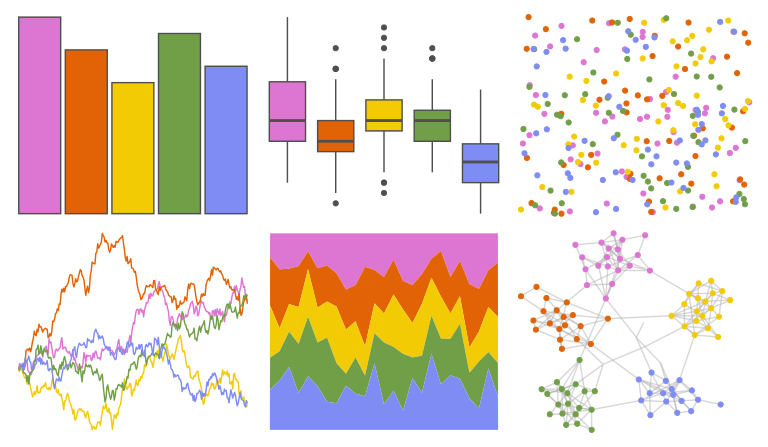

# fishualize - Callanthias_australis 

::: columns
::: {.column width="50%"}

**Github**

[nschiett/fishualize](https://github.com/nschiett/fishualize)
:::

::: {.column width="50%"}

**CRAN**

[fishualize](https://CRAN.R-project.org/package=fishualize)
:::
:::

<hr> 

Use with [paletteer](https://emilhvitfeldt.github.io/paletteer/) package:

```r
library(paletteer)
paletteer_d("fishualize::Callanthias_australis")
```

Use raw:

```r
c("#DD75D3FF", "#E16305FF", "#F2CB05FF", "#719F47FF", "#7E8CF3FF")
``` 

 

<br>

# Related Palettes

<div class="list" style="display: grid; grid-template-columns: auto auto auto;"> <figure class="figure">
<a href="../../awtools/a_palette/"> </a>
</figure> <figure class="figure">
<a href="../../ggthemes/excel_Berlin/"> </a>
</figure> <figure class="figure">
<a href="../../ggthemes/excel_Parallax/"> </a>
</figure> <figure class="figure">
<a href="../../ggthemes/excel_Atlas/"> </a>
</figure> <figure class="figure">
<a href="../../rockthemes/janelle/"> </a>
</figure> <figure class="figure">
<a href="../../fishualize/Bryaninops_natans/"> </a>
</figure> <figure class="figure">
<a href="../../colorblindr/OkabeIto/"> </a>
</figure> <figure class="figure">
<a href="../../lisa/M_C_Escher/"> </a>
</figure> <figure class="figure">
<a href="../../fishualize/Bodianus_rufus/"> </a>
</figure> <figure class="figure">
<a href="../../ggsci/default_nejm/"> </a>
</figure> <figure class="figure">
<a href="../../ggthemes/few_Medium/"> </a>
</figure> <figure class="figure">
<a href="../../lisa/Jean_MichelBasquiat/"> </a>
</figure> 
</div>
