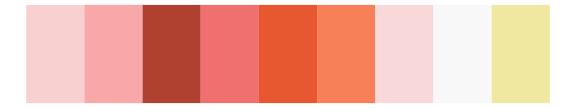

# fishualize - Cantherhines_macrocerus 

::: columns
::: {.column width="50%"}

**Github**

[nschiett/fishualize](https://github.com/nschiett/fishualize)
:::

::: {.column width="50%"}

**CRAN**

[fishualize](https://CRAN.R-project.org/package=fishualize)
:::
:::

<hr> 

Use with [paletteer](https://emilhvitfeldt.github.io/paletteer/) package:

```r
library(paletteer)
paletteer_d("fishualize::Cantherhines_macrocerus")
```

Use raw:

```r
c("#F3F0FAFF", "#FFF1E0FF", "#F2935CFF", "#F27141FF", "#BF604BFF")
``` 

 

<br>

# Related Palettes

<div class="list" style="display: grid; grid-template-columns: auto auto auto;"> <figure class="figure">
<a href="../../awtools/a_palette/"> </a>
</figure> <figure class="figure">
<a href="../../MetBrewer/OKeeffe2/"> </a>
</figure> <figure class="figure">
<a href="../../rcartocolor/Peach/"> </a>
</figure> <figure class="figure">
<a href="../../rcartocolor/OrYel/"> </a>
</figure> <figure class="figure">
<a href="../../calecopal/canary/"> </a>
</figure> <figure class="figure">
<a href="../../palettetown/chansey/"> </a>
</figure> <figure class="figure">
<a href="../../beyonce/X28/"> </a>
</figure> <figure class="figure">
<a href="../../lisa/JohannJacobUlrich/"> </a>
</figure> <figure class="figure">
<a href="../../fishualize/Lutjanus_jocu/"> </a>
</figure> <figure class="figure">
<a href="../../rcartocolor/PinkYl/"> </a>
</figure> <figure class="figure">
<a href="../../miscpalettes/jojo/"> </a>
</figure> <figure class="figure">
<a href="../../NineteenEightyR/miami1/"> </a>
</figure> 
</div>
