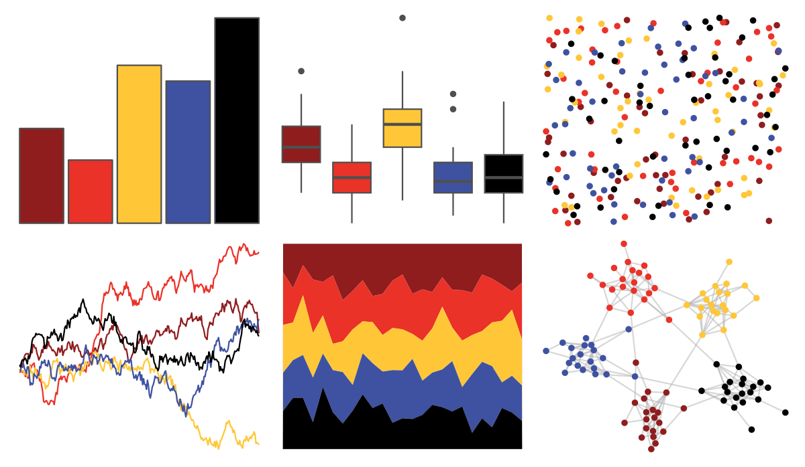

# fishualize - Centropyge_loricula 

::: columns
::: {.column width="50%"}

**Github**

[nschiett/fishualize](https://github.com/nschiett/fishualize)
:::

::: {.column width="50%"}

**CRAN**

[fishualize](https://CRAN.R-project.org/package=fishualize)
:::
:::

<hr> 

Use with [paletteer](https://emilhvitfeldt.github.io/paletteer/) package:

```r
library(paletteer)
paletteer_d("fishualize::Centropyge_loricula")
```

Use raw:

```r
c("#8F1D1EFF", "#EA3228FF", "#FFC737FF", "#3E52A1FF", "#000000FF")
``` 

 

<br>

# Related Palettes

<div class="list" style="display: grid; grid-template-columns: auto auto auto;"> <figure class="figure">
<a href="../../amerika/Dem_Ind_Rep3/"> </a>
</figure> <figure class="figure">
<a href="../../tvthemes/attackOnTitan/"> </a>
</figure> <figure class="figure">
<a href="../../tvthemes/FireNation/"> </a>
</figure> <figure class="figure">
<a href="../../ggthemes/wsj_colors6/"> </a>
</figure> <figure class="figure">
<a href="../../nbapalettes/suns/"> </a>
</figure> <figure class="figure">
<a href="../../nbapalettes/hawks_90s/"> </a>
</figure> <figure class="figure">
<a href="../../nbapalettes/cavaliers/"> </a>
</figure> <figure class="figure">
<a href="../../ggsci/default_uchicago/"> </a>
</figure> <figure class="figure">
<a href="../../tvthemes/Lannister/"> </a>
</figure> <figure class="figure">
<a href="../../nbapalettes/clippers/"> </a>
</figure> <figure class="figure">
<a href="../../ltc/hat/"> </a>
</figure> <figure class="figure">
<a href="../../ltc/ten_colors/"> </a>
</figure> 
</div>
