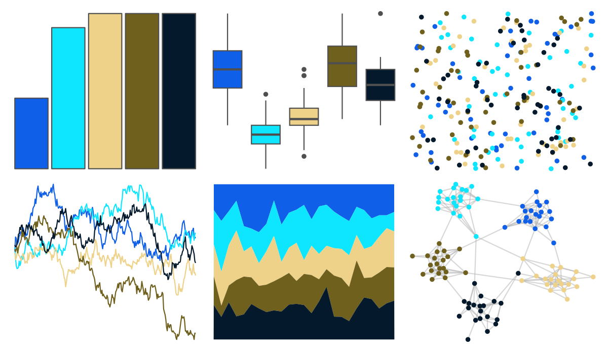

# fishualize - Cephalopholis_argus 

::: columns
::: {.column width="50%"}

**Github**

[nschiett/fishualize](https://github.com/nschiett/fishualize)
:::

::: {.column width="50%"}

**CRAN**

[fishualize](https://CRAN.R-project.org/package=fishualize)
:::
:::

<hr> 

Use with [paletteer](https://emilhvitfeldt.github.io/paletteer/) package:

```r
library(paletteer)
paletteer_d("fishualize::Cephalopholis_argus")
```

Use raw:

```r
c("#105FE8FF", "#0DE6FEFF", "#EFD289FF", "#70601EFF", "#041A2CFF")
``` 

 

<br>

# Related Palettes

<div class="list" style="display: grid; grid-template-columns: auto auto auto;"> <figure class="figure">
<a href="../../awtools/a_palette/"> </a>
</figure> <figure class="figure">
<a href="../../ButterflyColors/hamadryas_feronia/"> </a>
</figure> <figure class="figure">
<a href="../../ButterflyColors/hamadryas_feronia/"> </a>
</figure> <figure class="figure">
<a href="../../MexBrewer/Casita2/"> </a>
</figure> <figure class="figure">
<a href="../../MetBrewer/Lakota/"> </a>
</figure> <figure class="figure">
<a href="../../fishualize/Acanthurus_olivaceus/"> </a>
</figure> <figure class="figure">
<a href="../../lisa/RoyLichtenstein/"> </a>
</figure> <figure class="figure">
<a href="../../fishualize/Acanthurus_sohal/"> </a>
</figure> <figure class="figure">
<a href="../../lisa/HilmaafKlint/"> </a>
</figure> <figure class="figure">
<a href="../../khroma/mediumcontrast/"> </a>
</figure> <figure class="figure">
<a href="../../lisa/JacksonPollock/"> </a>
</figure> <figure class="figure">
<a href="../../rtist/pollock/"> </a>
</figure> 
</div>
