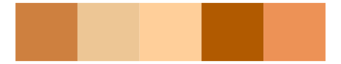
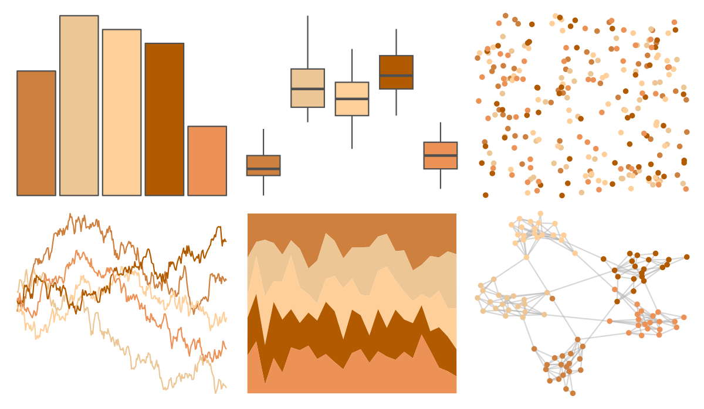

# fishualize - Cephalopholis_fulva 

::: columns
::: {.column width="50%"}

**Github**

[nschiett/fishualize](https://github.com/nschiett/fishualize)
:::

::: {.column width="50%"}

**CRAN**

[fishualize](https://CRAN.R-project.org/package=fishualize)
:::
:::

<hr> 

Use with [paletteer](https://emilhvitfeldt.github.io/paletteer/) package:

```r
library(paletteer)
paletteer_d("fishualize::Cephalopholis_fulva")
```

Use raw:

```r
c("#CE803FFF", "#EDC695FF", "#FFCF9AFF", "#B15A00FF", "#ED9256FF")
``` 

 

<br>

# Related Palettes

<div class="list" style="display: grid; grid-template-columns: auto auto auto;"> <figure class="figure">
<a href="../../amerika/Dem_Ind_Rep3/"> </a>
</figure> <figure class="figure">
<a href="../../calecopal/canary/"> </a>
</figure> <figure class="figure">
<a href="../../fishualize/Holocentrus_adscensionis/"> </a>
</figure> <figure class="figure">
<a href="../../PrettyCols/Tangerines/"> </a>
</figure> <figure class="figure">
<a href="../../MetBrewer/OKeeffe2/"> </a>
</figure> <figure class="figure">
<a href="../../ggsci/orange_material/"> </a>
</figure> <figure class="figure">
<a href="../../fishualize/Chormis_multilineata/"> </a>
</figure> <figure class="figure">
<a href="../../ggthemes/excel_Red_Orange/"> </a>
</figure> <figure class="figure">
<a href="../../lisa/MarkRothko/"> </a>
</figure> <figure class="figure">
<a href="../../rcartocolor/Peach/"> </a>
</figure> <figure class="figure">
<a href="../../fishualize/Cantherhines_macrocerus/"> </a>
</figure> <figure class="figure">
<a href="../../lisa/JohannJacobUlrich/"> </a>
</figure> 
</div>
