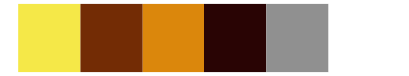
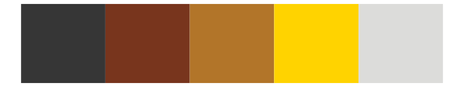

# fishualize - Chaetodon_ephippium 

::: columns
::: {.column width="50%"}

**Github**

[nschiett/fishualize](https://github.com/nschiett/fishualize)
:::

::: {.column width="50%"}

**CRAN**

[fishualize](https://CRAN.R-project.org/package=fishualize)
:::
:::

<hr> 

Use with [paletteer](https://emilhvitfeldt.github.io/paletteer/) package:

```r
library(paletteer)
paletteer_d("fishualize::Chaetodon_ephippium")
```

Use raw:

```r
c("#010101FF", "#6DAABDFF", "#CAECB3FF", "#F3CB04FF", "#E28027FF")
``` 

 

<br>

# Related Palettes

<div class="list" style="display: grid; grid-template-columns: auto auto auto;"> <figure class="figure">
<a href="../../awtools/a_palette/"> </a>
</figure> <figure class="figure">
<a href="../../tvthemes/Topaz/"> </a>
</figure> <figure class="figure">
<a href="../../fishualize/Chaetodon_larvatus/"> </a>
</figure> <figure class="figure">
<a href="../../fishualize/Naso_lituratus/"> </a>
</figure> <figure class="figure">
<a href="../../fishualize/Acanthurus_triostegus/"> </a>
</figure> <figure class="figure">
<a href="../../fishualize/Melichthys_vidua/"> </a>
</figure> <figure class="figure">
<a href="../../fishualize/Neogobius_melanostomus/"> </a>
</figure> <figure class="figure">
<a href="../../soilpalettes/rendoll/"> </a>
</figure> <figure class="figure">
<a href="../../colRoz/s_spinigerus/"> </a>
</figure> <figure class="figure">
<a href="../../fishualize/Oxymonacanthus_longirostris/"> </a>
</figure> <figure class="figure">
<a href="../../colRoz/p_mitchelli/"> </a>
</figure> <figure class="figure">
<a href="../../fishualize/Epibulus_insidiator/"> </a>
</figure> 
</div>
