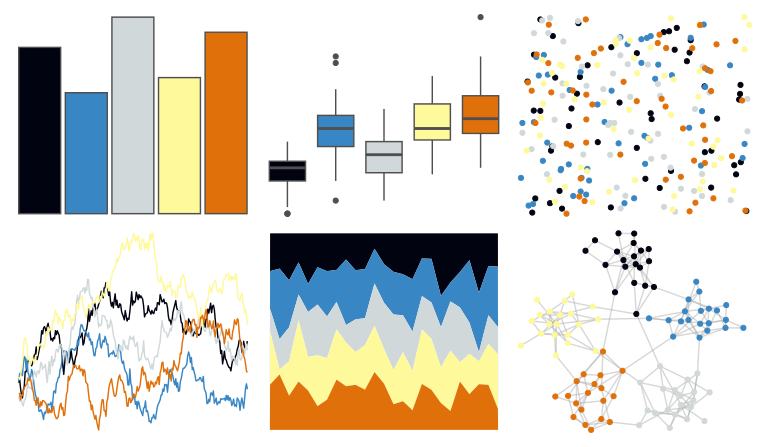

# fishualize - Chaetodon_larvatus 

::: columns
::: {.column width="50%"}

**Github**

[nschiett/fishualize](https://github.com/nschiett/fishualize)
:::

::: {.column width="50%"}

**CRAN**

[fishualize](https://CRAN.R-project.org/package=fishualize)
:::
:::

<hr> 

Use with [paletteer](https://emilhvitfeldt.github.io/paletteer/) package:

```r
library(paletteer)
paletteer_d("fishualize::Chaetodon_larvatus")
```

Use raw:

```r
c("#010310FF", "#3886C4FF", "#D0D8DAFF", "#FEF99AFF", "#E0700AFF")
``` 

 

<br>

# Related Palettes

<div class="list" style="display: grid; grid-template-columns: auto auto auto;"> <figure class="figure">
<a href="../../awtools/a_palette/"> </a>
</figure> <figure class="figure">
<a href="../../fishualize/Naso_lituratus/"> </a>
</figure> <figure class="figure">
<a href="../../ggthemes/colorblind/"> </a>
</figure> <figure class="figure">
<a href="../../khroma/okabeito/"> </a>
</figure> <figure class="figure">
<a href="../../fishualize/Chaetodon_ephippium/"> </a>
</figure> <figure class="figure">
<a href="../../tvthemes/Topaz/"> </a>
</figure> <figure class="figure">
<a href="../../colRoz/n_levis/"> </a>
</figure> <figure class="figure">
<a href="../../lisa/SolLeWitt/"> </a>
</figure> <figure class="figure">
<a href="../../lisa/RoyLichtenstein_1/"> </a>
</figure> <figure class="figure">
<a href="../../LaCroixColoR/PinaFraise/"> </a>
</figure> <figure class="figure">
<a href="../../fishualize/Oxymonacanthus_longirostris/"> </a>
</figure> <figure class="figure">
<a href="../../nbapalettes/grizzlies_europe/"> </a>
</figure> 
</div>
