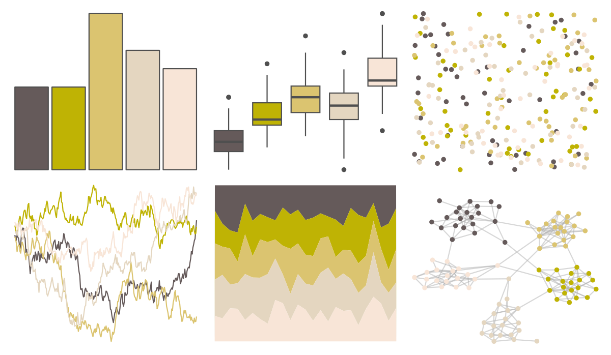

# fishualize - Chaetodon_sedentarius 

::: columns
::: {.column width="50%"}

**Github**

[nschiett/fishualize](https://github.com/nschiett/fishualize)
:::

::: {.column width="50%"}

**CRAN**

[fishualize](https://CRAN.R-project.org/package=fishualize)
:::
:::

<hr> 

Use with [paletteer](https://emilhvitfeldt.github.io/paletteer/) package:

```r
library(paletteer)
paletteer_d("fishualize::Chaetodon_sedentarius")
```

Use raw:

```r
c("#655A5AFF", "#BFB304FF", "#DBC470FF", "#E4D6C0FF", "#F8E5D7FF")
``` 

 

<br>

# Related Palettes

<div class="list" style="display: grid; grid-template-columns: auto auto auto;"> <figure class="figure">
<a href="../../amerika/Dem_Ind_Rep3/"> </a>
</figure> <figure class="figure">
<a href="../../lisa/RobertDelaunay_1/"> </a>
</figure> <figure class="figure">
<a href="../../nbapalettes/spurs/"> </a>
</figure> <figure class="figure">
<a href="../../wesanderson/Royal2/"> </a>
</figure> <figure class="figure">
<a href="../../wesanderson/Chevalier1/"> </a>
</figure> <figure class="figure">
<a href="../../palettetown/sandshrew/"> </a>
</figure> <figure class="figure">
<a href="../../palettetown/kabutops/"> </a>
</figure> <figure class="figure">
<a href="../../rcartocolor/ArmyRose/"> </a>
</figure> <figure class="figure">
<a href="../../ggthemes/excel_Mesh/"> </a>
</figure> <figure class="figure">
<a href="../../lisa/J_M_W_Turner/"> </a>
</figure> <figure class="figure">
<a href="../../palettetown/stantler/"> </a>
</figure> <figure class="figure">
<a href="../../wesanderson/Moonrise3/"> </a>
</figure> 
</div>
