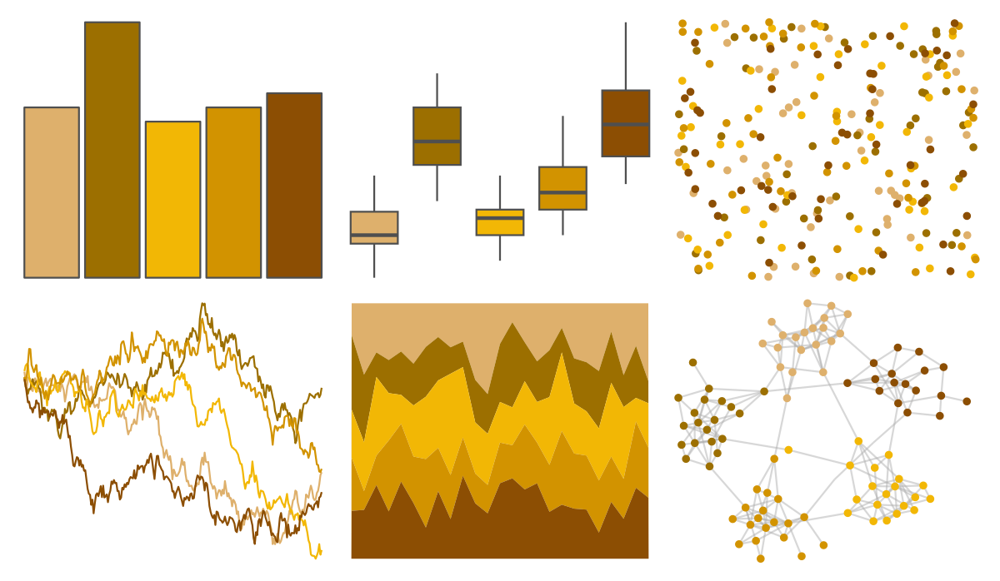

# fishualize - Chormis_multilineata 

::: columns
::: {.column width="50%"}

**Github**

[nschiett/fishualize](https://github.com/nschiett/fishualize)
:::

::: {.column width="50%"}

**CRAN**

[fishualize](https://CRAN.R-project.org/package=fishualize)
:::
:::

<hr> 

Use with [paletteer](https://emilhvitfeldt.github.io/paletteer/) package:

```r
library(paletteer)
paletteer_d("fishualize::Chormis_multilineata")
```

Use raw:

```r
c("#DEB06CFF", "#9C6F00FF", "#F2B705FF", "#D29300FF", "#8C4E03FF")
``` 

 

<br>

# Related Palettes

<div class="list" style="display: grid; grid-template-columns: auto auto auto;"> <figure class="figure">
<a href="../../awtools/a_palette/"> </a>
</figure> <figure class="figure">
<a href="../../fishualize/Hippocampus_reidi/"> </a>
</figure> <figure class="figure">
<a href="../../fishualize/Cephalopholis_fulva/"> </a>
</figure> <figure class="figure">
<a href="../../palettetown/swinub/"> </a>
</figure> <figure class="figure">
<a href="../../calecopal/eschscholzia/"> </a>
</figure> <figure class="figure">
<a href="../../calecopal/canary/"> </a>
</figure> <figure class="figure">
<a href="../../palettetown/abra/"> </a>
</figure> <figure class="figure">
<a href="../../soilpalettes/bangor/"> </a>
</figure> <figure class="figure">
<a href="../../colRoz/c_kingii/"> </a>
</figure> <figure class="figure">
<a href="../../fishualize/Labrisomus_nuchipinnis/"> </a>
</figure> <figure class="figure">
<a href="../../ggprism/flames/"> </a>
</figure> <figure class="figure">
<a href="../../fishualize/Holocentrus_adscensionis/"> </a>
</figure> 
</div>
