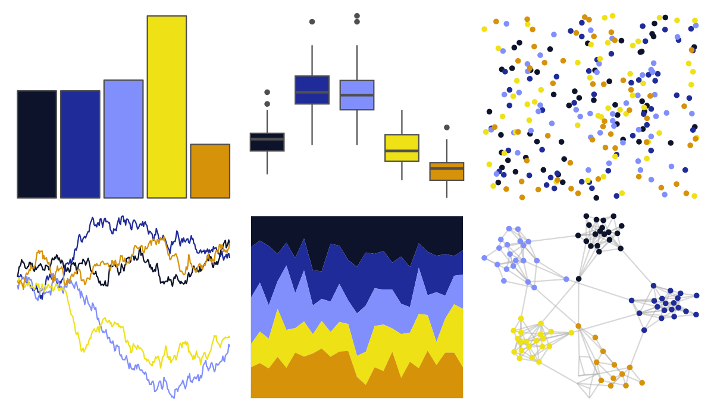

# fishualize - Chromis_vanderbilti 

::: columns
::: {.column width="50%"}

**Github**

[nschiett/fishualize](https://github.com/nschiett/fishualize)
:::

::: {.column width="50%"}

**CRAN**

[fishualize](https://CRAN.R-project.org/package=fishualize)
:::
:::

<hr> 

Use with [paletteer](https://emilhvitfeldt.github.io/paletteer/) package:

```r
library(paletteer)
paletteer_d("fishualize::Chromis_vanderbilti")
```

Use raw:

```r
c("#0D132AFF", "#1F2B98FF", "#808FFCFF", "#EEE115FF", "#D69209FF")
``` 

 

<br>

# Related Palettes

<div class="list" style="display: grid; grid-template-columns: auto auto auto;"> <figure class="figure">
<a href="../../amerika/Dem_Ind_Rep3/"> </a>
</figure> <figure class="figure">
<a href="../../fishualize/Pomacanthus_imperator/"> </a>
</figure> <figure class="figure">
<a href="../../ggprism/inferno/"> </a>
</figure> <figure class="figure">
<a href="../../ggprism/plasma/"> </a>
</figure> <figure class="figure">
<a href="../../colRoz/desert_dusk/"> </a>
</figure> <figure class="figure">
<a href="../../fishualize/Stegastes_variabilis/"> </a>
</figure> <figure class="figure">
<a href="../../ggprism/magma/"> </a>
</figure> <figure class="figure">
<a href="../../nbapalettes/mavericks_banner/"> </a>
</figure> <figure class="figure">
<a href="../../nbapalettes/nuggets/"> </a>
</figure> <figure class="figure">
<a href="../../waRhol/camo_87_3/"> </a>
</figure> <figure class="figure">
<a href="../../LaCroixColoR/MurePepino/"> </a>
</figure> <figure class="figure">
<a href="../../poisonfrogs/Dtnouragues/"> </a>
</figure> 
</div>
