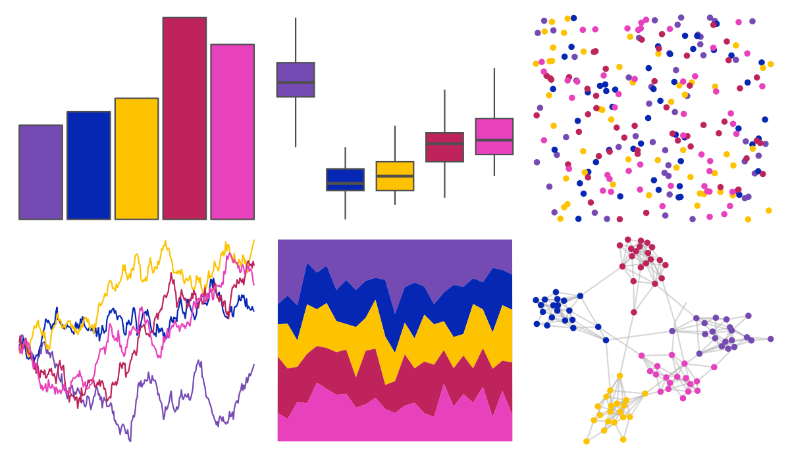

# fishualize - Cirrhilabrus_tonozukai 

::: columns
::: {.column width="50%"}

**Github**

[nschiett/fishualize](https://github.com/nschiett/fishualize)
:::

::: {.column width="50%"}

**CRAN**

[fishualize](https://CRAN.R-project.org/package=fishualize)
:::
:::

<hr> 

Use with [paletteer](https://emilhvitfeldt.github.io/paletteer/) package:

```r
library(paletteer)
paletteer_d("fishualize::Cirrhilabrus_tonozukai")
```

Use raw:

```r
c("#754AB3FF", "#0627B3FF", "#FDC300FF", "#BE245BFF", "#E841BDFF")
``` 

 

<br>

# Related Palettes

<div class="list" style="display: grid; grid-template-columns: auto auto auto;"> <figure class="figure">
<a href="../../amerika/Dem_Ind_Rep3/"> </a>
</figure> <figure class="figure">
<a href="../../waRhol/camo_87_3/"> </a>
</figure> <figure class="figure">
<a href="../../fishualize/Gramma_loreto/"> </a>
</figure> <figure class="figure">
<a href="../../lisa/JacobLawrence_1/"> </a>
</figure> <figure class="figure">
<a href="../../rcartocolor/ag_Sunset/"> </a>
</figure> <figure class="figure">
<a href="../../fishualize/Clepticus_parrae/"> </a>
</figure> <figure class="figure">
<a href="../../rockthemes/deelite/"> </a>
</figure> <figure class="figure">
<a href="../../vapoRwave/newRetro/"> </a>
</figure> <figure class="figure">
<a href="../../DresdenColor/briefcases/"> </a>
</figure> <figure class="figure">
<a href="../../ggprism/plasma/"> </a>
</figure> <figure class="figure">
<a href="../../beyonce/X41/"> </a>
</figure> <figure class="figure">
<a href="../../fishualize/Variola_louti/"> </a>
</figure> 
</div>
