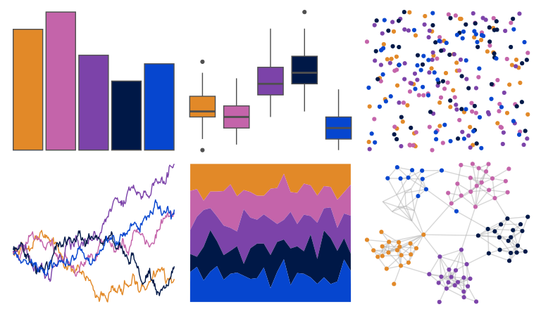

# fishualize - Clepticus_parrae 

::: columns
::: {.column width="50%"}

**Github**

[nschiett/fishualize](https://github.com/nschiett/fishualize)
:::

::: {.column width="50%"}

**CRAN**

[fishualize](https://CRAN.R-project.org/package=fishualize)
:::
:::

<hr> 

Use with [paletteer](https://emilhvitfeldt.github.io/paletteer/) package:

```r
library(paletteer)
paletteer_d("fishualize::Clepticus_parrae")
```

Use raw:

```r
c("#E28928FF", "#C464AAFF", "#7C43A9FF", "#001847FF", "#0646CFFF")
``` 

 

<br>

# Related Palettes

<div class="list" style="display: grid; grid-template-columns: auto auto auto;"> <figure class="figure">
<a href="../../awtools/a_palette/"> </a>
</figure> <figure class="figure">
<a href="../../fishualize/Cirrhilabrus_tonozukai/"> </a>
</figure> <figure class="figure">
<a href="../../vapoRwave/newRetro/"> </a>
</figure> <figure class="figure">
<a href="../../beyonce/X27/"> </a>
</figure> <figure class="figure">
<a href="../../fishualize/Gramma_loreto/"> </a>
</figure> <figure class="figure">
<a href="../../peRReo/ivyqueen/"> </a>
</figure> <figure class="figure">
<a href="../../PNWColors/Starfish/"> </a>
</figure> <figure class="figure">
<a href="../../beyonce/X37/"> </a>
</figure> <figure class="figure">
<a href="../../MapPalettes/bruiser/"> </a>
</figure> <figure class="figure">
<a href="../../lisa/PaulKlee_1/"> </a>
</figure> <figure class="figure">
<a href="../../calecopal/superbloom3/"> </a>
</figure> <figure class="figure">
<a href="../../lisa/JacobLawrence_1/"> </a>
</figure> 
</div>
