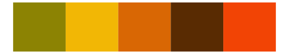

# fishualize - Dermatolepis_inermis 

::: columns
::: {.column width="50%"}

**Github**

[nschiett/fishualize](https://github.com/nschiett/fishualize)
:::

::: {.column width="50%"}

**CRAN**

[fishualize](https://CRAN.R-project.org/package=fishualize)
:::
:::

<hr> 

Use with [paletteer](https://emilhvitfeldt.github.io/paletteer/) package:

```r
library(paletteer)
paletteer_d("fishualize::Dermatolepis_inermis")
```

Use raw:

```r
c("#853709FF", "#542110FF", "#F2B705FF", "#F29F05FF", "#BF5B04FF")
``` 

 

<br>

# Related Palettes

<div class="list" style="display: grid; grid-template-columns: auto auto auto;"> <figure class="figure">
<a href="../../awtools/a_palette/"> </a>
</figure> <figure class="figure">
<a href="../../MetBrewer/Greek/"> </a>
</figure> <figure class="figure">
<a href="../../fishualize/Labrisomus_nuchipinnis/"> </a>
</figure> <figure class="figure">
<a href="../../NineteenEightyR/seventies_aint_done_yet/"> </a>
</figure> <figure class="figure">
<a href="../../fishualize/Hexagrammos_lagocephalus/"> </a>
</figure> <figure class="figure">
<a href="../../fishualize/Hippocampus_reidi/"> </a>
</figure> <figure class="figure">
<a href="../../MetBrewer/Peru2/"> </a>
</figure> <figure class="figure">
<a href="../../calecopal/eschscholzia/"> </a>
</figure> <figure class="figure">
<a href="../../fishualize/Pareiorhaphis_garbei/"> </a>
</figure> <figure class="figure">
<a href="../../rockthemes/alice/"> </a>
</figure> <figure class="figure">
<a href="../../ggthemes/excel_Red_Orange/"> </a>
</figure> <figure class="figure">
<a href="../../nbapalettes/nuggets_city/"> </a>
</figure> 
</div>
