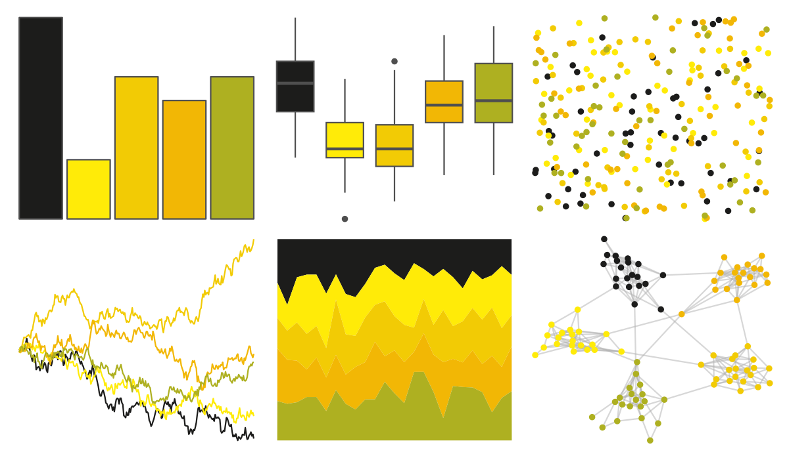
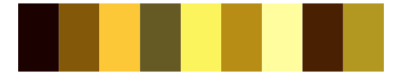

# fishualize - Elacatinus_figaro 

::: columns
::: {.column width="50%"}

**Github**

[nschiett/fishualize](https://github.com/nschiett/fishualize)
:::

::: {.column width="50%"}

**CRAN**

[fishualize](https://CRAN.R-project.org/package=fishualize)
:::
:::

<hr> 

Use with [paletteer](https://emilhvitfeldt.github.io/paletteer/) package:

```r
library(paletteer)
paletteer_d("fishualize::Elacatinus_figaro")
```

Use raw:

```r
c("#1C1C1BFF", "#FFEB08FF", "#F2CB05FF", "#F2B705FF", "#AEB021FF")
``` 

 

<br>

# Related Palettes

<div class="list" style="display: grid; grid-template-columns: auto auto auto;"> <figure class="figure">
<a href="../../awtools/a_palette/"> </a>
</figure> <figure class="figure">
<a href="../../colRoz/k_scurra/"> </a>
</figure> <figure class="figure">
<a href="../../peRReo/daddy2/"> </a>
</figure> <figure class="figure">
<a href="../../fishualize/Antennarius_multiocellatus/"> </a>
</figure> <figure class="figure">
<a href="../../fishualize/Halichoeres_garnoti/"> </a>
</figure> <figure class="figure">
<a href="../../palettetown/abra/"> </a>
</figure> <figure class="figure">
<a href="../../fishualize/Ostracion_cubicus/"> </a>
</figure> <figure class="figure">
<a href="../../lisa/SandySkoglund/"> </a>
</figure> <figure class="figure">
<a href="../../fishualize/Balistoides_conspicillum/"> </a>
</figure> <figure class="figure">
<a href="../../palettetown/gulpin/"> </a>
</figure> <figure class="figure">
<a href="../../tvthemes/EarthKingdom/"> </a>
</figure> <figure class="figure">
<a href="../../werpals/monet/"> </a>
</figure> 
</div>
