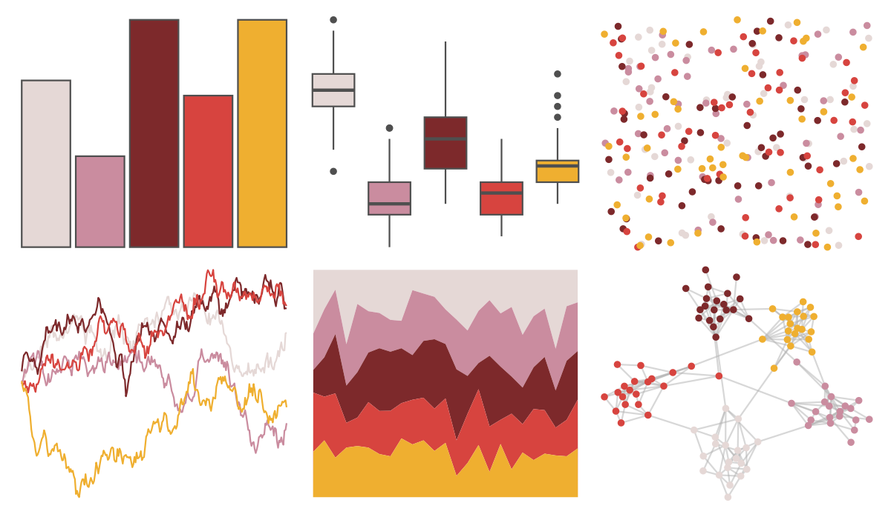

# fishualize - Epinephelus_fasciatus 

::: columns
::: {.column width="50%"}

**Github**

[nschiett/fishualize](https://github.com/nschiett/fishualize)
:::

::: {.column width="50%"}

**CRAN**

[fishualize](https://CRAN.R-project.org/package=fishualize)
:::
:::

<hr> 

Use with [paletteer](https://emilhvitfeldt.github.io/paletteer/) package:

```r
library(paletteer)
paletteer_d("fishualize::Epinephelus_fasciatus")
```

Use raw:

```r
c("#E5D8D6FF", "#CA8C9FFF", "#7D292BFF", "#D7443FFF", "#EFAF30FF")
``` 

 

<br>

# Related Palettes

<div class="list" style="display: grid; grid-template-columns: auto auto auto;"> <figure class="figure">
<a href="../../amerika/Dem_Ind_Rep3/"> </a>
</figure> <figure class="figure">
<a href="../../PNWColors/Moth/"> </a>
</figure> <figure class="figure">
<a href="../../colRoz/grandis/"> </a>
</figure> <figure class="figure">
<a href="../../waRhol/basquiat_85/"> </a>
</figure> <figure class="figure">
<a href="../../fishualize/Nemateleotris_magnifica/"> </a>
</figure> <figure class="figure">
<a href="../../lisa/WinslowHomer/"> </a>
</figure> <figure class="figure">
<a href="../../futurevisions/cancri/"> </a>
</figure> <figure class="figure">
<a href="../../lisa/MiltonAvery_1/"> </a>
</figure> <figure class="figure">
<a href="../../soilpalettes/crait/"> </a>
</figure> <figure class="figure">
<a href="../../wesanderson/Royal1/"> </a>
</figure> <figure class="figure">
<a href="../../soilpalettes/alaquod/"> </a>
</figure> <figure class="figure">
<a href="../../tayloRswift/midnightsBloodMoon/"> </a>
</figure> 
</div>
