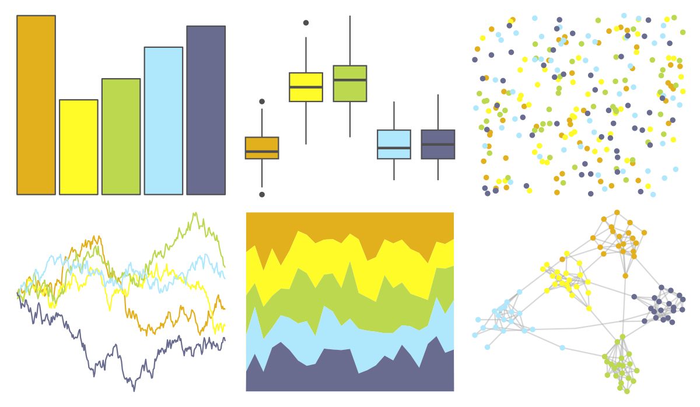
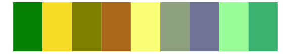
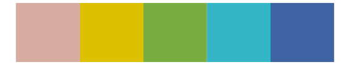
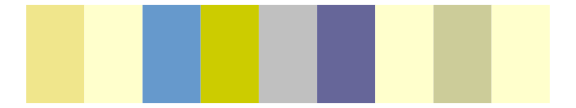

# fishualize - Forcipiger_longirostris 

::: columns
::: {.column width="50%"}

**Github**

[nschiett/fishualize](https://github.com/nschiett/fishualize)
:::

::: {.column width="50%"}

**CRAN**

[fishualize](https://CRAN.R-project.org/package=fishualize)
:::
:::

<hr> 

Use with [paletteer](https://emilhvitfeldt.github.io/paletteer/) package:

```r
library(paletteer)
paletteer_d("fishualize::Forcipiger_longirostris")
```

Use raw:

```r
c("#E3B01DFF", "#FEFB29FF", "#BBD84EFF", "#AFE8FCFF", "#696C8FFF")
``` 

 

<br>

# Related Palettes

<div class="list" style="display: grid; grid-template-columns: auto auto auto;"> <figure class="figure">
<a href="../../amerika/Dem_Ind_Rep3/"> </a>
</figure> <figure class="figure">
<a href="../../tvthemes/Tyrell/"> </a>
</figure> <figure class="figure">
<a href="../../MetBrewer/Isfahan2/"> </a>
</figure> <figure class="figure">
<a href="../../fishualize/Valenciennea_strigata/"> </a>
</figure> <figure class="figure">
<a href="../../lisa/VincentvanGogh_1/"> </a>
</figure> <figure class="figure">
<a href="../../ggthemes/excel_Depth/"> </a>
</figure> <figure class="figure">
<a href="../../ggprism/ocean2/"> </a>
</figure> <figure class="figure">
<a href="../../fishualize/Haemulon_squamipinna/"> </a>
</figure> <figure class="figure">
<a href="../../khroma/light/"> </a>
</figure> <figure class="figure">
<a href="../../ggprism/spring2/"> </a>
</figure> <figure class="figure">
<a href="../../ggthemes/excel_Madison/"> </a>
</figure> <figure class="figure">
<a href="../../fishualize/Myrichthys_ocellatus/"> </a>
</figure> 
</div>
