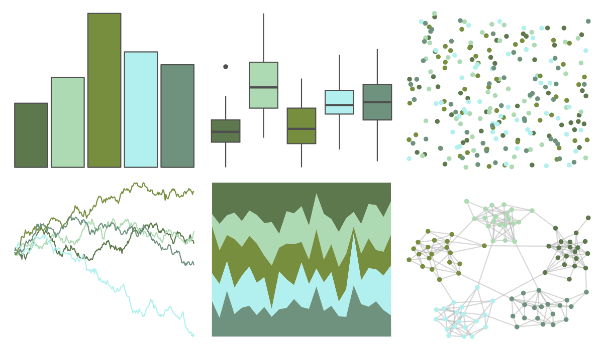

# fishualize - Gadus_morhua 

::: columns
::: {.column width="50%"}

**Github**

[nschiett/fishualize](https://github.com/nschiett/fishualize)
:::

::: {.column width="50%"}

**CRAN**

[fishualize](https://CRAN.R-project.org/package=fishualize)
:::
:::

<hr> 

Use with [paletteer](https://emilhvitfeldt.github.io/paletteer/) package:

```r
library(paletteer)
paletteer_d("fishualize::Gadus_morhua")
```

Use raw:

```r
c("#5D784CFF", "#ADDAB3FF", "#778E3FFF", "#B1F0EEFF", "#6E927DFF")
``` 

 

<br>

# Related Palettes

<div class="list" style="display: grid; grid-template-columns: auto auto auto;"> <figure class="figure">
<a href="../../awtools/a_palette/"> </a>
</figure> <figure class="figure">
<a href="../../Redmonder/qMSOGnYl/"> </a>
</figure> <figure class="figure">
<a href="../../fishualize/Parablennius_pilicornis/"> </a>
</figure> <figure class="figure">
<a href="../../nationalparkcolors/Yellowstone/"> </a>
</figure> <figure class="figure">
<a href="../../yarrr/bugs/"> </a>
</figure> <figure class="figure">
<a href="../../nationalparkcolors/Voyageurs/"> </a>
</figure> <figure class="figure">
<a href="../../Redmonder/qMSOGn/"> </a>
</figure> <figure class="figure">
<a href="../../ghibli/MarnieLight2/"> </a>
</figure> <figure class="figure">
<a href="../../palettetown/graveler/"> </a>
</figure> <figure class="figure">
<a href="../../Redmonder/sPBIYlGn/"> </a>
</figure> <figure class="figure">
<a href="../../PNWColors/Anemone/"> </a>
</figure> <figure class="figure">
<a href="../../palettetown/geodude/"> </a>
</figure> 
</div>
