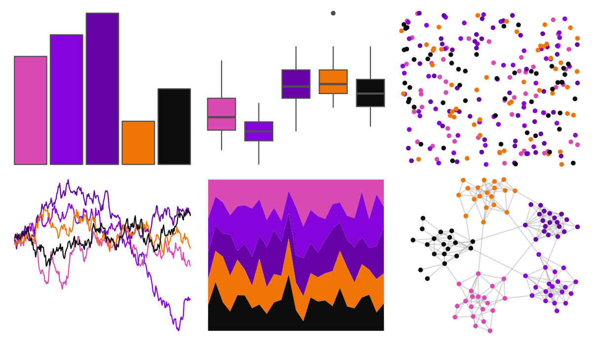

# fishualize - Gramma_brasiliensis 

::: columns
::: {.column width="50%"}

**Github**

[nschiett/fishualize](https://github.com/nschiett/fishualize)
:::

::: {.column width="50%"}

**CRAN**

[fishualize](https://CRAN.R-project.org/package=fishualize)
:::
:::

<hr> 

Use with [paletteer](https://emilhvitfeldt.github.io/paletteer/) package:

```r
library(paletteer)
paletteer_d("fishualize::Gramma_brasiliensis")
```

Use raw:

```r
c("#D94AB3FF", "#8404D9FF", "#6503A6FF", "#F27405FF", "#0D0D0DFF")
``` 

 

<br>

# Related Palettes

<div class="list" style="display: grid; grid-template-columns: auto auto auto;"> <figure class="figure">
<a href="../../awtools/a_palette/"> </a>
</figure> <figure class="figure">
<a href="../../lisa/PaulKlee_1/"> </a>
</figure> <figure class="figure">
<a href="../../fishualize/Clepticus_parrae/"> </a>
</figure> <figure class="figure">
<a href="../../peRReo/ivyqueen/"> </a>
</figure> <figure class="figure">
<a href="../../nbapalettes/suns_00s/"> </a>
</figure> <figure class="figure">
<a href="../../beyonce/X37/"> </a>
</figure> <figure class="figure">
<a href="../../nbapalettes/kings_alt/"> </a>
</figure> <figure class="figure">
<a href="../../nbapalettes/sixers/"> </a>
</figure> <figure class="figure">
<a href="../../nbapalettes/raptors/"> </a>
</figure> <figure class="figure">
<a href="../../peRReo/natti/"> </a>
</figure> <figure class="figure">
<a href="../../NineteenEightyR/cobra/"> </a>
</figure> <figure class="figure">
<a href="../../nbapalettes/hornets_classic/"> </a>
</figure> 
</div>
