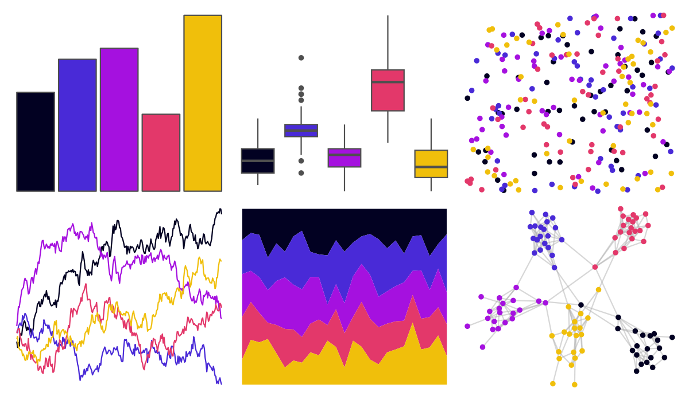

# fishualize - Gramma_loreto 

::: columns
::: {.column width="50%"}

**Github**

[nschiett/fishualize](https://github.com/nschiett/fishualize)
:::

::: {.column width="50%"}

**CRAN**

[fishualize](https://CRAN.R-project.org/package=fishualize)
:::
:::

<hr> 

Use with [paletteer](https://emilhvitfeldt.github.io/paletteer/) package:

```r
library(paletteer)
paletteer_d("fishualize::Gramma_loreto")
```

Use raw:

```r
c("#020122FF", "#492AD7FF", "#A511DFFF", "#E3386AFF", "#F0BF0BFF")
``` 

 

<br>

# Related Palettes

<div class="list" style="display: grid; grid-template-columns: auto auto auto;"> <figure class="figure">
<a href="../../awtools/a_palette/"> </a>
</figure> <figure class="figure">
<a href="../../ButterflyColors/hamadryas_feronia/"> </a>
</figure> <figure class="figure">
<a href="../../ButterflyColors/hamadryas_feronia/"> </a>
</figure> <figure class="figure">
<a href="../../fishualize/Cirrhilabrus_tonozukai/"> </a>
</figure> <figure class="figure">
<a href="../../waRhol/camo_87_3/"> </a>
</figure> <figure class="figure">
<a href="../../fishualize/Variola_louti/"> </a>
</figure> <figure class="figure">
<a href="../../nbapalettes/nuggets_80s/"> </a>
</figure> <figure class="figure">
<a href="../../nbapalettes/nuggets/"> </a>
</figure> <figure class="figure">
<a href="../../fishualize/Clepticus_parrae/"> </a>
</figure> <figure class="figure">
<a href="../../ggprism/plasma/"> </a>
</figure> <figure class="figure">
<a href="../../ggprism/magma/"> </a>
</figure> <figure class="figure">
<a href="../../nbapalettes/nuggets_statement/"> </a>
</figure> 
</div>
