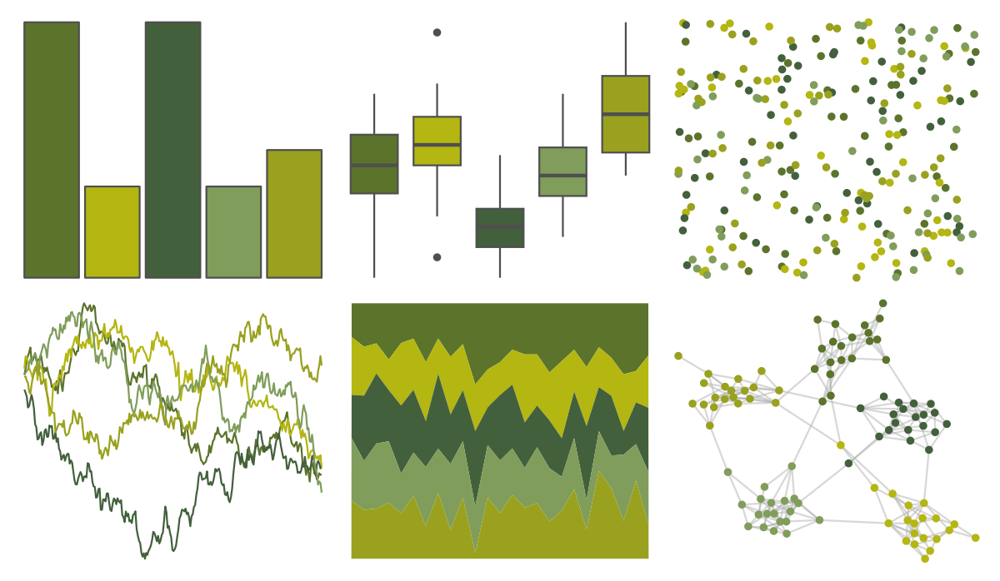
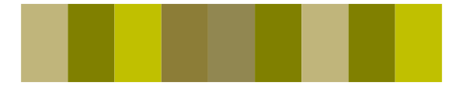

# fishualize - Gymnothorax_funebris 

::: columns
::: {.column width="50%"}

**Github**

[nschiett/fishualize](https://github.com/nschiett/fishualize)
:::

::: {.column width="50%"}

**CRAN**

[fishualize](https://CRAN.R-project.org/package=fishualize)
:::
:::

<hr> 

Use with [paletteer](https://emilhvitfeldt.github.io/paletteer/) package:

```r
library(paletteer)
paletteer_d("fishualize::Gymnothorax_funebris")
```

Use raw:

```r
c("#5C732CFF", "#B4B611FF", "#43603CFF", "#809D5BFF", "#99A11FFF")
``` 

 

<br>

# Related Palettes

<div class="list" style="display: grid; grid-template-columns: auto auto auto;"> <figure class="figure">
<a href="../../awtools/a_palette/"> </a>
</figure> <figure class="figure">
<a href="../../palettetown/cacturne/"> </a>
</figure> <figure class="figure">
<a href="../../ggprism/mustard_field/"> </a>
</figure> <figure class="figure">
<a href="../../tvthemes/Peridot/"> </a>
</figure> <figure class="figure">
<a href="../../palettetown/diglett/"> </a>
</figure> <figure class="figure">
<a href="../../werpals/monet/"> </a>
</figure> <figure class="figure">
<a href="../../colRoz/k_scurra/"> </a>
</figure> <figure class="figure">
<a href="../../lisa/RemediosVaro/"> </a>
</figure> <figure class="figure">
<a href="../../fishualize/Elacatinus_figaro/"> </a>
</figure> <figure class="figure">
<a href="../../tvthemes/EarthKingdom/"> </a>
</figure> <figure class="figure">
<a href="../../fishualize/Micropterus_punctulatus/"> </a>
</figure> <figure class="figure">
<a href="../../palettetown/abra/"> </a>
</figure> 
</div>
