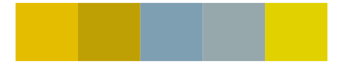
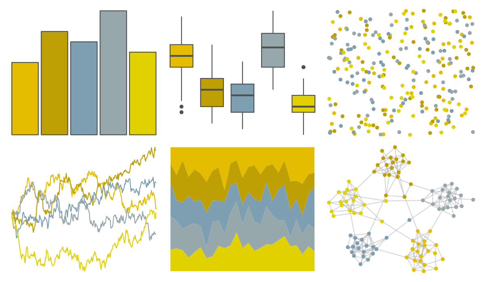

# fishualize - Haemulon_squamipinna 

::: columns
::: {.column width="50%"}

**Github**

[nschiett/fishualize](https://github.com/nschiett/fishualize)
:::

::: {.column width="50%"}

**CRAN**

[fishualize](https://CRAN.R-project.org/package=fishualize)
:::
:::

<hr> 

Use with [paletteer](https://emilhvitfeldt.github.io/paletteer/) package:

```r
library(paletteer)
paletteer_d("fishualize::Haemulon_squamipinna")
```

Use raw:

```r
c("#E5BD00FF", "#BFA004FF", "#7E9FB2FF", "#97A8ADFF", "#E1D100FF")
``` 

 

<br>

# Related Palettes

<div class="list" style="display: grid; grid-template-columns: auto auto auto;"> <figure class="figure">
<a href="../../awtools/a_palette/"> </a>
</figure> <figure class="figure">
<a href="../../ButterflyColors/hamadryas_feronia/"> </a>
</figure> <figure class="figure">
<a href="../../ButterflyColors/hamadryas_feronia/"> </a>
</figure> <figure class="figure">
<a href="../../lisa/VincentvanGogh_1/"> </a>
</figure> <figure class="figure">
<a href="../../fishualize/Valenciennea_strigata/"> </a>
</figure> <figure class="figure">
<a href="../../fishualize/Chaetodon_sedentarius/"> </a>
</figure> <figure class="figure">
<a href="../../fishualize/Hemitaurichthys_polylepis/"> </a>
</figure> <figure class="figure">
<a href="../../fishualize/Acanthisthius_brasilianus/"> </a>
</figure> <figure class="figure">
<a href="../../lisa/RobertDelaunay_1/"> </a>
</figure> <figure class="figure">
<a href="../../calecopal/sierra2/"> </a>
</figure> <figure class="figure">
<a href="../../PNWColors/Cascades/"> </a>
</figure> <figure class="figure">
<a href="../../ggprism/quiet2/"> </a>
</figure> 
</div>
