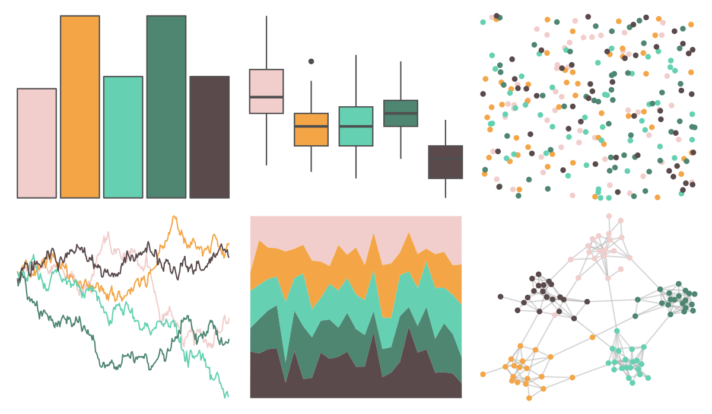

# fishualize - Halichoeres_radiatus 

::: columns
::: {.column width="50%"}

**Github**

[nschiett/fishualize](https://github.com/nschiett/fishualize)
:::

::: {.column width="50%"}

**CRAN**

[fishualize](https://CRAN.R-project.org/package=fishualize)
:::
:::

<hr> 

Use with [paletteer](https://emilhvitfeldt.github.io/paletteer/) package:

```r
library(paletteer)
paletteer_d("fishualize::Halichoeres_radiatus")
```

Use raw:

```r
c("#F1CECCFF", "#F4A647FF", "#65D1B2FF", "#4E8672FF", "#5B4A4CFF")
``` 

 

<br>

# Related Palettes

<div class="list" style="display: grid; grid-template-columns: auto auto auto;"> <figure class="figure">
<a href="../../amerika/Dem_Ind_Rep3/"> </a>
</figure> <figure class="figure">
<a href="../../calecopal/superbloom1/"> </a>
</figure> <figure class="figure">
<a href="../../MoMAColors/Smith/"> </a>
</figure> <figure class="figure">
<a href="../../nationalparkcolors/Everglades/"> </a>
</figure> <figure class="figure">
<a href="../../tayloRswift/lover/"> </a>
</figure> <figure class="figure">
<a href="../../lisa/MarcelDuchamp/"> </a>
</figure> <figure class="figure">
<a href="../../yarrr/decision/"> </a>
</figure> <figure class="figure">
<a href="../../Redmonder/qMSO15/"> </a>
</figure> <figure class="figure">
<a href="../../Manu/Takapu/"> </a>
</figure> <figure class="figure">
<a href="../../nationalparkcolors/CraterLake/"> </a>
</figure> <figure class="figure">
<a href="../../nationalparkcolors/MtMckinley/"> </a>
</figure> <figure class="figure">
<a href="../../MoMAColors/Lupi/"> </a>
</figure> 
</div>
