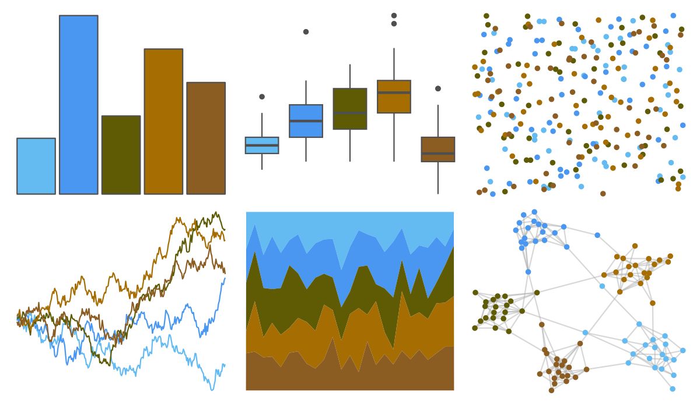

# fishualize - Hamulon_plumieri 

::: columns
::: {.column width="50%"}

**Github**

[nschiett/fishualize](https://github.com/nschiett/fishualize)
:::

::: {.column width="50%"}

**CRAN**

[fishualize](https://CRAN.R-project.org/package=fishualize)
:::
:::

<hr> 

Use with [paletteer](https://emilhvitfeldt.github.io/paletteer/) package:

```r
library(paletteer)
paletteer_d("fishualize::Hamulon_plumieri")
```

Use raw:

```r
c("#63BBF2FF", "#4997F0FF", "#5E5B04FF", "#A66D03FF", "#8C5D23FF")
``` 

 

<br>

# Related Palettes

<div class="list" style="display: grid; grid-template-columns: auto auto auto;"> <figure class="figure">
<a href="../../amerika/Dem_Ind_Rep3/"> </a>
</figure> <figure class="figure">
<a href="../../MetBrewer/Isfahan1/"> </a>
</figure> <figure class="figure">
<a href="../../MetBrewer/Degas/"> </a>
</figure> <figure class="figure">
<a href="../../soilpalettes/redox/"> </a>
</figure> <figure class="figure">
<a href="../../LaCroixColoR/Orange/"> </a>
</figure> <figure class="figure">
<a href="../../fishualize/Histiophryne_psychedelica/"> </a>
</figure> <figure class="figure">
<a href="../../calecopal/kelp1/"> </a>
</figure> <figure class="figure">
<a href="../../fishualize/Balistes_vetula/"> </a>
</figure> <figure class="figure">
<a href="../../fishualize/Parablennius_marmoreus/"> </a>
</figure> <figure class="figure">
<a href="../../MoMAColors/Abbott/"> </a>
</figure> <figure class="figure">
<a href="../../MetBrewer/Navajo/"> </a>
</figure> <figure class="figure">
<a href="../../poisonfrogs/Rmarina/"> </a>
</figure> 
</div>
