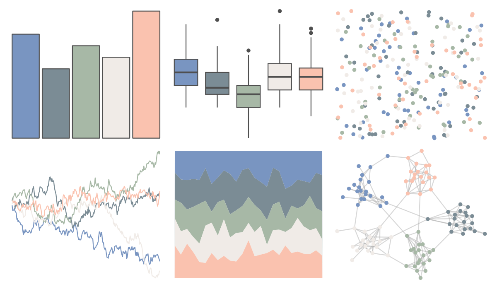
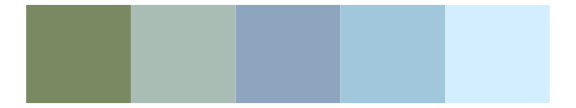

# fishualize - Harengula_jaguana 

::: columns
::: {.column width="50%"}

**Github**

[nschiett/fishualize](https://github.com/nschiett/fishualize)
:::

::: {.column width="50%"}

**CRAN**

[fishualize](https://CRAN.R-project.org/package=fishualize)
:::
:::

<hr> 

Use with [paletteer](https://emilhvitfeldt.github.io/paletteer/) package:

```r
library(paletteer)
paletteer_d("fishualize::Harengula_jaguana")
```

Use raw:

```r
c("#7995C1FF", "#7B8C95FF", "#A7B8A6FF", "#F0EBE7FF", "#FAC2AFFF")
``` 

 

<br>

# Related Palettes

<div class="list" style="display: grid; grid-template-columns: auto auto auto;"> <figure class="figure">
<a href="../../amerika/Dem_Ind_Rep3/"> </a>
</figure> <figure class="figure">
<a href="../../ghibli/MononokeLight/"> </a>
</figure> <figure class="figure">
<a href="../../ghibli/LaputaLight/"> </a>
</figure> <figure class="figure">
<a href="../../ltc/reading/"> </a>
</figure> <figure class="figure">
<a href="../../musculusColors/Bmpoop/"> </a>
</figure> <figure class="figure">
<a href="../../ghibli/SpiritedLight/"> </a>
</figure> <figure class="figure">
<a href="../../ghibli/YesterdayLight/"> </a>
</figure> <figure class="figure">
<a href="../../calecopal/collinsia/"> </a>
</figure> <figure class="figure">
<a href="../../fishualize/Sardinella_brasiliensis/"> </a>
</figure> <figure class="figure">
<a href="../../nord/afternoon_prarie/"> </a>
</figure> <figure class="figure">
<a href="../../futurevisions/venus/"> </a>
</figure> <figure class="figure">
<a href="../../ltc/gaby/"> </a>
</figure> 
</div>
