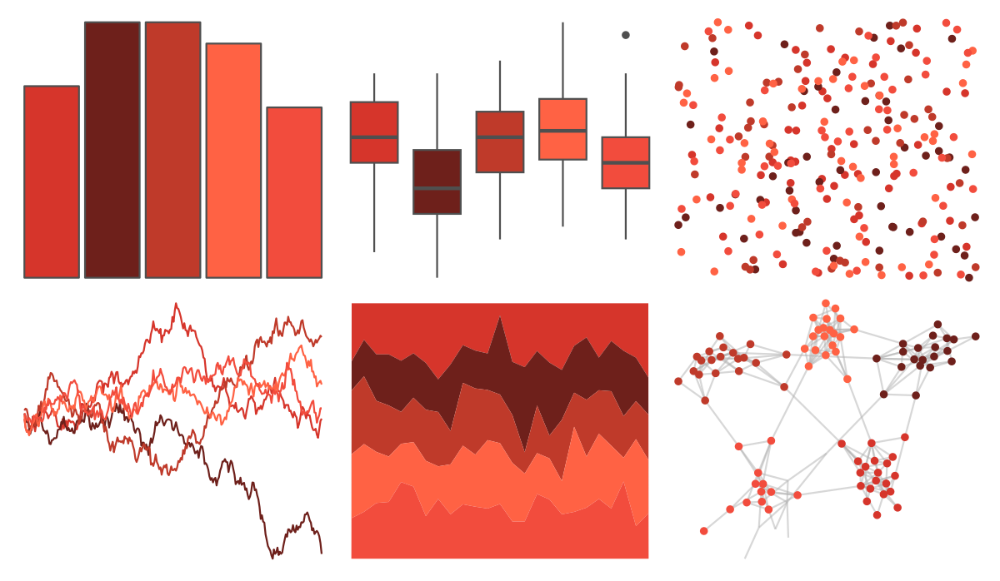

# fishualize - Heretopriacanthus_cruentatus 

::: columns
::: {.column width="50%"}

**Github**

[nschiett/fishualize](https://github.com/nschiett/fishualize)
:::

::: {.column width="50%"}

**CRAN**

[fishualize](https://CRAN.R-project.org/package=fishualize)
:::
:::

<hr> 

Use with [paletteer](https://emilhvitfeldt.github.io/paletteer/) package:

```r
library(paletteer)
paletteer_d("fishualize::Heretopriacanthus_cruentatus")
```

Use raw:

```r
c("#D6352BFF", "#6E201BFF", "#BF3A2AFF", "#FF6244FF", "#F24C3DFF")
``` 

 

<br>

# Related Palettes

<div class="list" style="display: grid; grid-template-columns: auto auto auto;"> <figure class="figure">
<a href="../../awtools/a_palette/"> </a>
</figure> <figure class="figure">
<a href="../../fishualize/Acanthostracion_polygonius_y/"> </a>
</figure> <figure class="figure">
<a href="../../fishualize/Sargocentron_bullisi/"> </a>
</figure> <figure class="figure">
<a href="../../fishualize/Sparisoma_tuyupiranga_f/"> </a>
</figure> <figure class="figure">
<a href="../../ggprism/autumn_leaves/"> </a>
</figure> <figure class="figure">
<a href="../../lisa/TerryFrost/"> </a>
</figure> <figure class="figure">
<a href="../../beyonce/X109/"> </a>
</figure> <figure class="figure">
<a href="../../trekcolors/red_alert/"> </a>
</figure> <figure class="figure">
<a href="../../miscpalettes/chocolate/"> </a>
</figure> <figure class="figure">
<a href="../../beyonce/X20/"> </a>
</figure> <figure class="figure">
<a href="../../calecopal/vermillion/"> </a>
</figure> <figure class="figure">
<a href="../../ggsci/red_material/"> </a>
</figure> 
</div>
