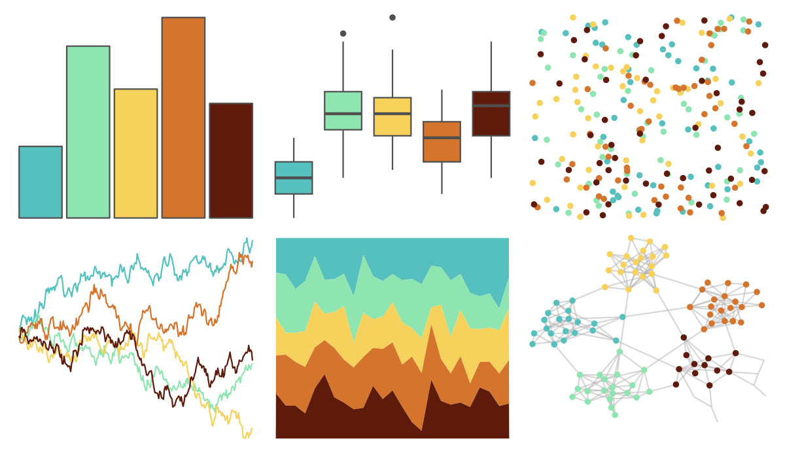
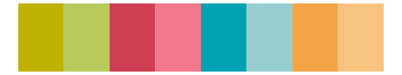

# fishualize - Lepomis_megalotis 

::: columns
::: {.column width="50%"}

**Github**

[nschiett/fishualize](https://github.com/nschiett/fishualize)
:::

::: {.column width="50%"}

**CRAN**

[fishualize](https://CRAN.R-project.org/package=fishualize)
:::
:::

<hr> 

Use with [paletteer](https://emilhvitfeldt.github.io/paletteer/) package:

```r
library(paletteer)
paletteer_d("fishualize::Lepomis_megalotis")
```

Use raw:

```r
c("#56C0BFFF", "#8EE5B0FF", "#F6D25CFF", "#D5752DFF", "#5E1A0AFF")
``` 

 

<br>

# Related Palettes

<div class="list" style="display: grid; grid-template-columns: auto auto auto;"> <figure class="figure">
<a href="../../awtools/a_palette/"> </a>
</figure> <figure class="figure">
<a href="../../fishualize/Etheostoma_barrenense/"> </a>
</figure> <figure class="figure">
<a href="../../MetBrewer/Homer1/"> </a>
</figure> <figure class="figure">
<a href="../../fishualize/Neogobius_melanostomus/"> </a>
</figure> <figure class="figure">
<a href="../../werpals/pan/"> </a>
</figure> <figure class="figure">
<a href="../../fishualize/Hypoplectrus_puella/"> </a>
</figure> <figure class="figure">
<a href="../../ggthemes/excel_Vapor_Trail/"> </a>
</figure> <figure class="figure">
<a href="../../fishualize/Scarus_hoefleri/"> </a>
</figure> <figure class="figure">
<a href="../../colRoz/p_mitchelli/"> </a>
</figure> <figure class="figure">
<a href="../../yarrr/nemo/"> </a>
</figure> <figure class="figure">
<a href="../../lisa/BridgetRiley/"> </a>
</figure> <figure class="figure">
<a href="../../ggthemes/Summer/"> </a>
</figure> 
</div>
