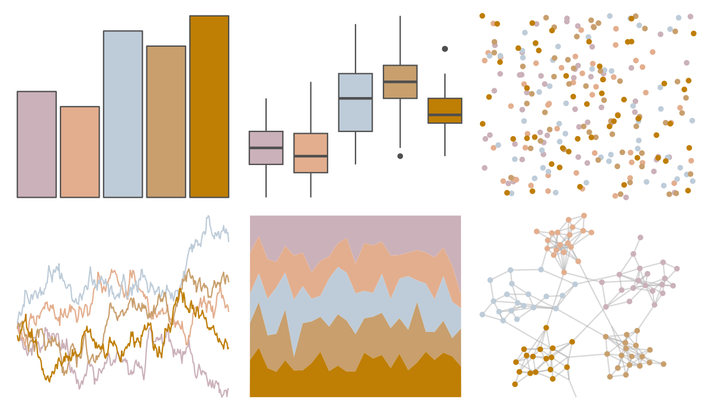

# fishualize - Lutjanus_jocu 

::: columns
::: {.column width="50%"}

**Github**

[nschiett/fishualize](https://github.com/nschiett/fishualize)
:::

::: {.column width="50%"}

**CRAN**

[fishualize](https://CRAN.R-project.org/package=fishualize)
:::
:::

<hr> 

Use with [paletteer](https://emilhvitfeldt.github.io/paletteer/) package:

```r
library(paletteer)
paletteer_d("fishualize::Lutjanus_jocu")
```

Use raw:

```r
c("#CBB1B9FF", "#E3AE8EFF", "#BECCD9FF", "#C89F6DFF", "#BF7E04FF")
``` 

 

<br>

# Related Palettes

<div class="list" style="display: grid; grid-template-columns: auto auto auto;"> <figure class="figure">
<a href="../../amerika/Dem_Ind_Rep3/"> </a>
</figure> <figure class="figure">
<a href="../../nationalparkcolors/BryceCanyon/"> </a>
</figure> <figure class="figure">
<a href="../../nbapalettes/spurs/"> </a>
</figure> <figure class="figure">
<a href="../../wesanderson/Royal2/"> </a>
</figure> <figure class="figure">
<a href="../../fishualize/Oncorhynchus_mykiss/"> </a>
</figure> <figure class="figure">
<a href="../../Redmonder/sPBIOr/"> </a>
</figure> <figure class="figure">
<a href="../../lisa/FernandoBotero/"> </a>
</figure> <figure class="figure">
<a href="../../lisa/J_M_W_Turner/"> </a>
</figure> <figure class="figure">
<a href="../../fishualize/Lycengraulis_grossidens/"> </a>
</figure> <figure class="figure">
<a href="../../fishualize/Xyrichthys_novacula/"> </a>
</figure> <figure class="figure">
<a href="../../ltc/paloma/"> </a>
</figure> <figure class="figure">
<a href="../../waRhol/basquiat_85/"> </a>
</figure> 
</div>
