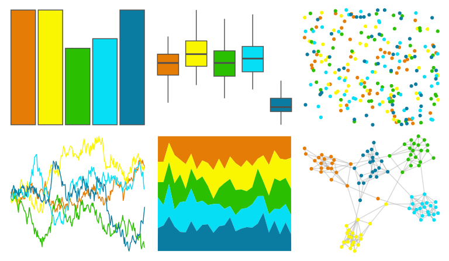

# fishualize - Minilabrus_striatus 

::: columns
::: {.column width="50%"}

**Github**

[nschiett/fishualize](https://github.com/nschiett/fishualize)
:::

::: {.column width="50%"}

**CRAN**

[fishualize](https://CRAN.R-project.org/package=fishualize)
:::
:::

<hr> 

Use with [paletteer](https://emilhvitfeldt.github.io/paletteer/) package:

```r
library(paletteer)
paletteer_d("fishualize::Minilabrus_striatus")
```

Use raw:

```r
c("#E57C05FF", "#FAF500FF", "#2ABF01FF", "#05DEF5FF", "#0A7CA1FF")
``` 

 

<br>

# Related Palettes

<div class="list" style="display: grid; grid-template-columns: auto auto auto;"> <figure class="figure">
<a href="../../awtools/a_palette/"> </a>
</figure> <figure class="figure">
<a href="../../fishualize/Stethojulis_bandanensis/"> </a>
</figure> <figure class="figure">
<a href="../../fishualize/Hypoplectrus_puella/"> </a>
</figure> <figure class="figure">
<a href="../../fishualize/Cirrhilabrus_solorensis/"> </a>
</figure> <figure class="figure">
<a href="../../feathers/bee_eater/"> </a>
</figure> <figure class="figure">
<a href="../../fishualize/Sparisoma_viride/"> </a>
</figure> <figure class="figure">
<a href="../../LaCroixColoR/Lemon/"> </a>
</figure> <figure class="figure">
<a href="../../ggthemes/excel_Vapor_Trail/"> </a>
</figure> <figure class="figure">
<a href="../../fishualize/Scarus_hoefleri/"> </a>
</figure> <figure class="figure">
<a href="../../fishualize/Holacanthus_ciliaris/"> </a>
</figure> <figure class="figure">
<a href="../../LaCroixColoR/KeyLime/"> </a>
</figure> <figure class="figure">
<a href="../../MetBrewer/Isfahan2/"> </a>
</figure> 
</div>
