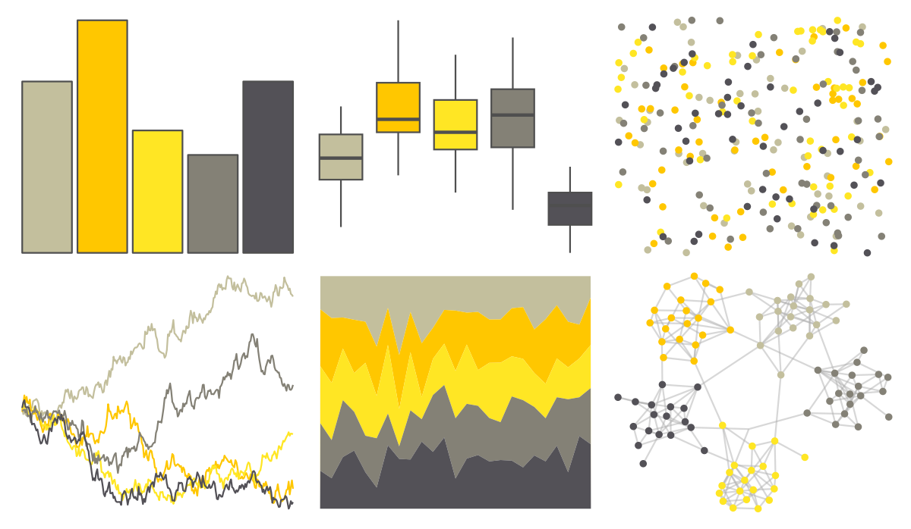

# fishualize - Myrichthys_ocellatus 

::: columns
::: {.column width="50%"}

**Github**

[nschiett/fishualize](https://github.com/nschiett/fishualize)
:::

::: {.column width="50%"}

**CRAN**

[fishualize](https://CRAN.R-project.org/package=fishualize)
:::
:::

<hr> 

Use with [paletteer](https://emilhvitfeldt.github.io/paletteer/) package:

```r
library(paletteer)
paletteer_d("fishualize::Myrichthys_ocellatus")
```

Use raw:

```r
c("#C3BF9DFF", "#FFC700FF", "#FFE624FF", "#848176FF", "#535157FF")
``` 

 

<br>

# Related Palettes

<div class="list" style="display: grid; grid-template-columns: auto auto auto;"> <figure class="figure">
<a href="../../awtools/a_palette/"> </a>
</figure> <figure class="figure">
<a href="../../ButterflyColors/hamadryas_feronia/"> </a>
</figure> <figure class="figure">
<a href="../../ButterflyColors/hamadryas_feronia/"> </a>
</figure> <figure class="figure">
<a href="../../palettetown/sandshrew/"> </a>
</figure> <figure class="figure">
<a href="../../palettetown/kakuna/"> </a>
</figure> <figure class="figure">
<a href="../../fishualize/Chaetodon_sedentarius/"> </a>
</figure> <figure class="figure">
<a href="../../lisa/FrancescoXanto/"> </a>
</figure> <figure class="figure">
<a href="../../lisa/VincentvanGogh_1/"> </a>
</figure> <figure class="figure">
<a href="../../peRReo/rosalia/"> </a>
</figure> <figure class="figure">
<a href="../../fishualize/Valenciennea_strigata/"> </a>
</figure> <figure class="figure">
<a href="../../lisa/SandySkoglund/"> </a>
</figure> <figure class="figure">
<a href="../../lisa/JohnSingerSargent_1/"> </a>
</figure> 
</div>
