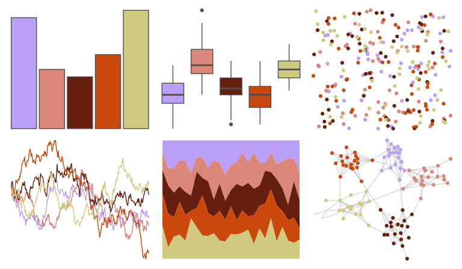

# fishualize - Nemateleotris_magnifica 

::: columns
::: {.column width="50%"}

**Github**

[nschiett/fishualize](https://github.com/nschiett/fishualize)
:::

::: {.column width="50%"}

**CRAN**

[fishualize](https://CRAN.R-project.org/package=fishualize)
:::
:::

<hr> 

Use with [paletteer](https://emilhvitfeldt.github.io/paletteer/) package:

```r
library(paletteer)
paletteer_d("fishualize::Nemateleotris_magnifica")
```

Use raw:

```r
c("#BA9FF7FF", "#DA8679FF", "#661F0FFF", "#CB480DFF", "#D0CA80FF")
``` 

 

<br>

# Related Palettes

<div class="list" style="display: grid; grid-template-columns: auto auto auto;"> <figure class="figure">
<a href="../../awtools/a_palette/"> </a>
</figure> <figure class="figure">
<a href="../../DresdenColor/skingame/"> </a>
</figure> <figure class="figure">
<a href="../../fishualize/Epinephelus_fasciatus/"> </a>
</figure> <figure class="figure">
<a href="../../NineteenEightyR/sunset1/"> </a>
</figure> <figure class="figure">
<a href="../../colRoz/grandis/"> </a>
</figure> <figure class="figure">
<a href="../../colRoz/c_brevi/"> </a>
</figure> <figure class="figure">
<a href="../../rockthemes/janelle/"> </a>
</figure> <figure class="figure">
<a href="../../lisa/MiltonAvery_1/"> </a>
</figure> <figure class="figure">
<a href="../../futurevisions/cancri/"> </a>
</figure> <figure class="figure">
<a href="../../fishualize/Bodianus_pulchellus/"> </a>
</figure> <figure class="figure">
<a href="../../lisa/JamesJean/"> </a>
</figure> <figure class="figure">
<a href="../../futurevisions/grand_tour/"> </a>
</figure> 
</div>
