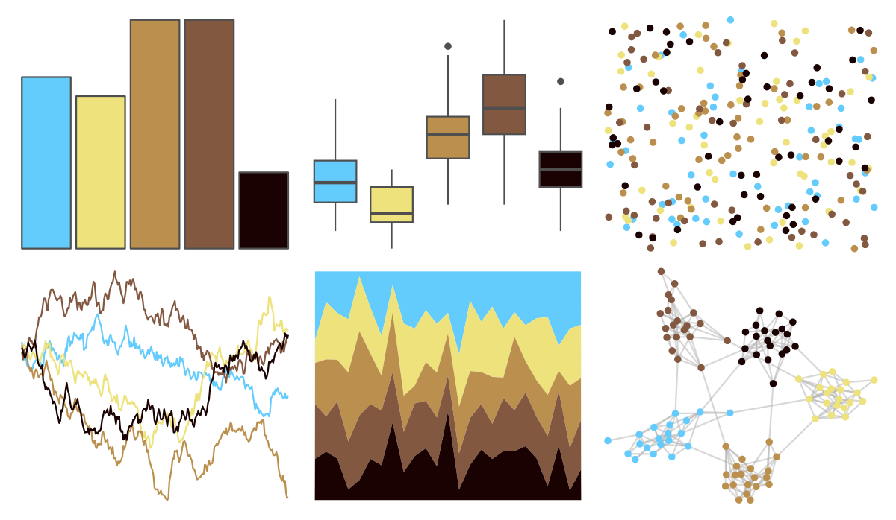

# fishualize - Neogobius_melanostomus 

::: columns
::: {.column width="50%"}

**Github**

[nschiett/fishualize](https://github.com/nschiett/fishualize)
:::

::: {.column width="50%"}

**CRAN**

[fishualize](https://CRAN.R-project.org/package=fishualize)
:::
:::

<hr> 

Use with [paletteer](https://emilhvitfeldt.github.io/paletteer/) package:

```r
library(paletteer)
paletteer_d("fishualize::Neogobius_melanostomus")
```

Use raw:

```r
c("#64CCFCFF", "#EDE27BFF", "#BB904EFF", "#825841FF", "#1A0202FF")
``` 

 

<br>

# Related Palettes

<div class="list" style="display: grid; grid-template-columns: auto auto auto;"> <figure class="figure">
<a href="../../amerika/Dem_Ind_Rep3/"> </a>
</figure> <figure class="figure">
<a href="../../fishualize/Etheostoma_barrenense/"> </a>
</figure> <figure class="figure">
<a href="../../fishualize/Lepomis_megalotis/"> </a>
</figure> <figure class="figure">
<a href="../../fishualize/Chaetodontoplus_conspicillatus/"> </a>
</figure> <figure class="figure">
<a href="../../poisonfrogs/Oslita/"> </a>
</figure> <figure class="figure">
<a href="../../fishualize/Acanthurus_triostegus/"> </a>
</figure> <figure class="figure">
<a href="../../vangogh/StarryNight/"> </a>
</figure> <figure class="figure">
<a href="../../fishualize/Histiophryne_psychedelica/"> </a>
</figure> <figure class="figure">
<a href="../../poisonfrogs/Afemoralis/"> </a>
</figure> <figure class="figure">
<a href="../../lisa/RoyLichtenstein_1/"> </a>
</figure> <figure class="figure">
<a href="../../fishualize/Chaetodon_ephippium/"> </a>
</figure> <figure class="figure">
<a href="../../colRoz/p_mitchelli/"> </a>
</figure> 
</div>
