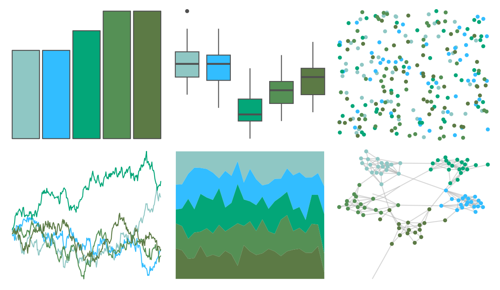

# fishualize - Parablennius_pilicornis 

::: columns
::: {.column width="50%"}

**Github**

[nschiett/fishualize](https://github.com/nschiett/fishualize)
:::

::: {.column width="50%"}

**CRAN**

[fishualize](https://CRAN.R-project.org/package=fishualize)
:::
:::

<hr> 

Use with [paletteer](https://emilhvitfeldt.github.io/paletteer/) package:

```r
library(paletteer)
paletteer_d("fishualize::Parablennius_pilicornis")
```

Use raw:

```r
c("#8FC7C4FF", "#32BDFFFF", "#03A678FF", "#559055FF", "#5C7A45FF")
``` 

 

<br>

# Related Palettes

<div class="list" style="display: grid; grid-template-columns: auto auto auto;"> <figure class="figure">
<a href="../../amerika/Dem_Ind_Rep3/"> </a>
</figure> <figure class="figure">
<a href="../../fishualize/Gadus_morhua/"> </a>
</figure> <figure class="figure">
<a href="../../ggthemes/excel_Green_Yellow/"> </a>
</figure> <figure class="figure">
<a href="../../Redmonder/qMSOGnYl/"> </a>
</figure> <figure class="figure">
<a href="../../RColorBrewer/BuGn/"> </a>
</figure> <figure class="figure">
<a href="../../ggthemes/excel_Blue_II/"> </a>
</figure> <figure class="figure">
<a href="../../ggthemes/excel_Integral/"> </a>
</figure> <figure class="figure">
<a href="../../ggthemes/excel_Savon/"> </a>
</figure> <figure class="figure">
<a href="../../Redmonder/qMSOGn/"> </a>
</figure> <figure class="figure">
<a href="../../unikn/pal_seegruen/"> </a>
</figure> <figure class="figure">
<a href="../../ggsci/teal_material/"> </a>
</figure> <figure class="figure">
<a href="../../miscpalettes/seaGreen/"> </a>
</figure> 
</div>
