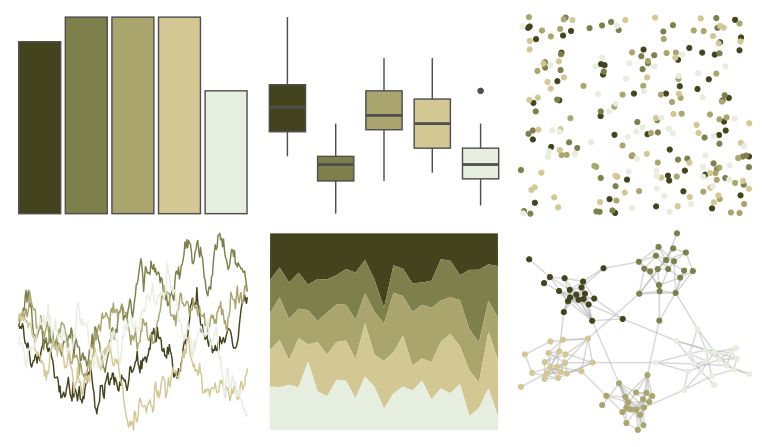

# fishualize - Paralabrax_clathratus 

::: columns
::: {.column width="50%"}

**Github**

[nschiett/fishualize](https://github.com/nschiett/fishualize)
:::

::: {.column width="50%"}

**CRAN**

[fishualize](https://CRAN.R-project.org/package=fishualize)
:::
:::

<hr> 

Use with [paletteer](https://emilhvitfeldt.github.io/paletteer/) package:

```r
library(paletteer)
paletteer_d("fishualize::Paralabrax_clathratus")
```

Use raw:

```r
c("#43431DFF", "#7D804BFF", "#A9A56DFF", "#D3C793FF", "#E6EEE0FF")
``` 

 

<br>

# Related Palettes

<div class="list" style="display: grid; grid-template-columns: auto auto auto;"> <figure class="figure">
<a href="../../awtools/a_palette/"> </a>
</figure> <figure class="figure">
<a href="../../palettetown/diglett/"> </a>
</figure> <figure class="figure">
<a href="../../calecopal/chaparral3/"> </a>
</figure> <figure class="figure">
<a href="../../palettetown/geodude/"> </a>
</figure> <figure class="figure">
<a href="../../palettetown/graveler/"> </a>
</figure> <figure class="figure">
<a href="../../Redmonder/sPBIYl/"> </a>
</figure> <figure class="figure">
<a href="../../lisa/JohnQuidor/"> </a>
</figure> <figure class="figure">
<a href="../../palettetown/eevee/"> </a>
</figure> <figure class="figure">
<a href="../../lisa/RemediosVaro/"> </a>
</figure> <figure class="figure">
<a href="../../yarrr/bugs/"> </a>
</figure> <figure class="figure">
<a href="../../nationalparkcolors/Yellowstone/"> </a>
</figure> <figure class="figure">
<a href="../../lisa/OttoDix_1/"> </a>
</figure> 
</div>
