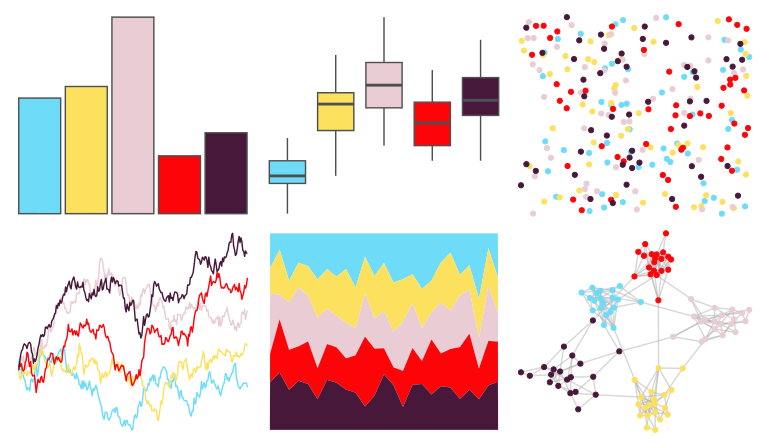

# fishualize - Parupeneus_insularis 

::: columns
::: {.column width="50%"}

**Github**

[nschiett/fishualize](https://github.com/nschiett/fishualize)
:::

::: {.column width="50%"}

**CRAN**

[fishualize](https://CRAN.R-project.org/package=fishualize)
:::
:::

<hr> 

Use with [paletteer](https://emilhvitfeldt.github.io/paletteer/) package:

```r
library(paletteer)
paletteer_d("fishualize::Parupeneus_insularis")
```

Use raw:

```r
c("#6EDCF9FF", "#FCE15EFF", "#E9CCD4FF", "#FD0409FF", "#471839FF")
``` 

 

<br>

# Related Palettes

<div class="list" style="display: grid; grid-template-columns: auto auto auto;"> <figure class="figure">
<a href="../../awtools/a_palette/"> </a>
</figure> <figure class="figure">
<a href="../../lisa/SolLeWitt/"> </a>
</figure> <figure class="figure">
<a href="../../lisa/RoyLichtenstein_1/"> </a>
</figure> <figure class="figure">
<a href="../../futurevisions/atomic_clock/"> </a>
</figure> <figure class="figure">
<a href="../../lisa/ClaesOldenburg/"> </a>
</figure> <figure class="figure">
<a href="../../rtist/oldenburg/"> </a>
</figure> <figure class="figure">
<a href="../../LaCroixColoR/PeachPear/"> </a>
</figure> <figure class="figure">
<a href="../../fishualize/Chaetodon_larvatus/"> </a>
</figure> <figure class="figure">
<a href="../../fishualize/Etheostoma_barrenense/"> </a>
</figure> <figure class="figure">
<a href="../../jcolors/pal5/"> </a>
</figure> <figure class="figure">
<a href="../../fishualize/Epibulus_insidiator/"> </a>
</figure> <figure class="figure">
<a href="../../nbapalettes/grizzlies_europe/"> </a>
</figure> 
</div>
