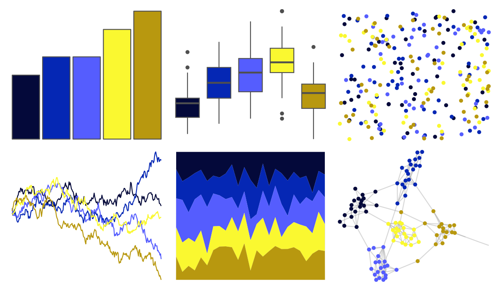
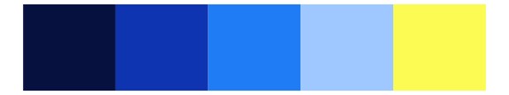
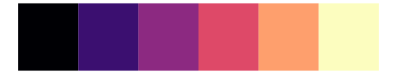

# fishualize - Pomacanthus_imperator 

::: columns
::: {.column width="50%"}

**Github**

[nschiett/fishualize](https://github.com/nschiett/fishualize)
:::

::: {.column width="50%"}

**CRAN**

[fishualize](https://CRAN.R-project.org/package=fishualize)
:::
:::

<hr> 

Use with [paletteer](https://emilhvitfeldt.github.io/paletteer/) package:

```r
library(paletteer)
paletteer_d("fishualize::Pomacanthus_imperator")
```

Use raw:

```r
c("#04093AFF", "#0527B4FF", "#555DFEFF", "#FAF830FF", "#B8980FFF")
``` 

 

<br>

# Related Palettes

<div class="list" style="display: grid; grid-template-columns: auto auto auto;"> <figure class="figure">
<a href="../../awtools/a_palette/"> </a>
</figure> <figure class="figure">
<a href="../../ButterflyColors/hamadryas_feronia/"> </a>
</figure> <figure class="figure">
<a href="../../ButterflyColors/hamadryas_feronia/"> </a>
</figure> <figure class="figure">
<a href="../../fishualize/Chromis_vanderbilti/"> </a>
</figure> <figure class="figure">
<a href="../../fishualize/Acanthurus_leucosternon/"> </a>
</figure> <figure class="figure">
<a href="../../fishualize/Paracanthurus_hepatus/"> </a>
</figure> <figure class="figure">
<a href="../../ggprism/plasma/"> </a>
</figure> <figure class="figure">
<a href="../../fishualize/Stegastes_variabilis/"> </a>
</figure> <figure class="figure">
<a href="../../waRhol/camo_87_3/"> </a>
</figure> <figure class="figure">
<a href="../../nbapalettes/nuggets/"> </a>
</figure> <figure class="figure">
<a href="../../ggprism/viridis/"> </a>
</figure> <figure class="figure">
<a href="../../ggprism/magma/"> </a>
</figure> 
</div>
