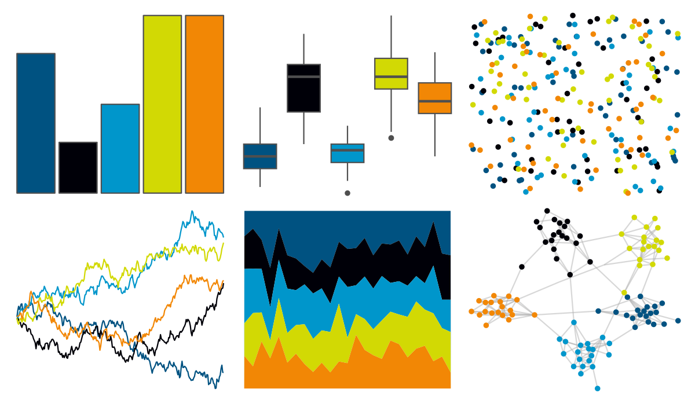

# fishualize - Pomacanthus_paru 

::: columns
::: {.column width="50%"}

**Github**

[nschiett/fishualize](https://github.com/nschiett/fishualize)
:::

::: {.column width="50%"}

**CRAN**

[fishualize](https://CRAN.R-project.org/package=fishualize)
:::
:::

<hr> 

Use with [paletteer](https://emilhvitfeldt.github.io/paletteer/) package:

```r
library(paletteer)
paletteer_d("fishualize::Pomacanthus_paru")
```

Use raw:

```r
c("#005281FF", "#000008FF", "#0096CBFF", "#D2D904FF", "#F28705FF")
``` 

 

<br>

# Related Palettes

<div class="list" style="display: grid; grid-template-columns: auto auto auto;"> <figure class="figure">
<a href="../../amerika/Dem_Ind_Rep3/"> </a>
</figure> <figure class="figure">
<a href="../../feathers/bee_eater/"> </a>
</figure> <figure class="figure">
<a href="../../fishualize/Scarus_tricolor/"> </a>
</figure> <figure class="figure">
<a href="../../PNWColors/Bay/"> </a>
</figure> <figure class="figure">
<a href="../../MetBrewer/Johnson/"> </a>
</figure> <figure class="figure">
<a href="../../fishualize/Thalassoma_pavo/"> </a>
</figure> <figure class="figure">
<a href="../../PrettyCols/Disco/"> </a>
</figure> <figure class="figure">
<a href="../../nbapalettes/thunder_city2/"> </a>
</figure> <figure class="figure">
<a href="../../ggthemes/excel_Slice/"> </a>
</figure> <figure class="figure">
<a href="../../RSkittleBrewer/original/"> </a>
</figure> <figure class="figure">
<a href="../../fishualize/Chromis_vanderbilti/"> </a>
</figure> <figure class="figure">
<a href="../../vangogh/StarryNight/"> </a>
</figure> 
</div>
