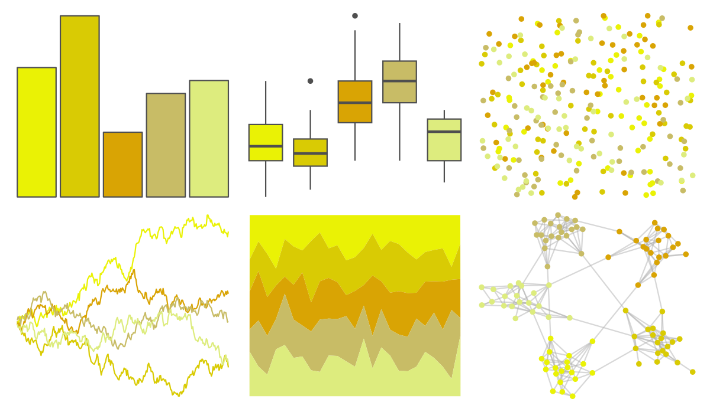
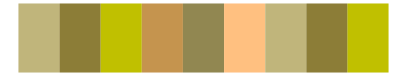

# fishualize - Prognathodes_brasiliensis 

::: columns
::: {.column width="50%"}

**Github**

[nschiett/fishualize](https://github.com/nschiett/fishualize)
:::

::: {.column width="50%"}

**CRAN**

[fishualize](https://CRAN.R-project.org/package=fishualize)
:::
:::

<hr> 

Use with [paletteer](https://emilhvitfeldt.github.io/paletteer/) package:

```r
library(paletteer)
paletteer_d("fishualize::Prognathodes_brasiliensis")
```

Use raw:

```r
c("#EAF205FF", "#D9CB04FF", "#D9A404FF", "#C8BC66FF", "#DDEC7EFF")
``` 

 

<br>

# Related Palettes

<div class="list" style="display: grid; grid-template-columns: auto auto auto;"> <figure class="figure">
<a href="../../awtools/a_palette/"> </a>
</figure> <figure class="figure">
<a href="../../ButterflyColors/hamadryas_feronia/"> </a>
</figure> <figure class="figure">
<a href="../../ButterflyColors/hamadryas_feronia/"> </a>
</figure> <figure class="figure">
<a href="../../PrettyCols/Yellows/"> </a>
</figure> <figure class="figure">
<a href="../../ggsci/lime_material/"> </a>
</figure> <figure class="figure">
<a href="../../ggprism/mustard_field/"> </a>
</figure> <figure class="figure">
<a href="../../waRhol/skull_76_1/"> </a>
</figure> <figure class="figure">
<a href="../../ggprism/mustard_field2/"> </a>
</figure> <figure class="figure">
<a href="../../ggsci/yellow_material/"> </a>
</figure> <figure class="figure">
<a href="../../colRoz/c_kingii/"> </a>
</figure> <figure class="figure">
<a href="../../fishualize/Gymnothorax_funebris/"> </a>
</figure> <figure class="figure">
<a href="../../palettetown/abra/"> </a>
</figure> 
</div>
