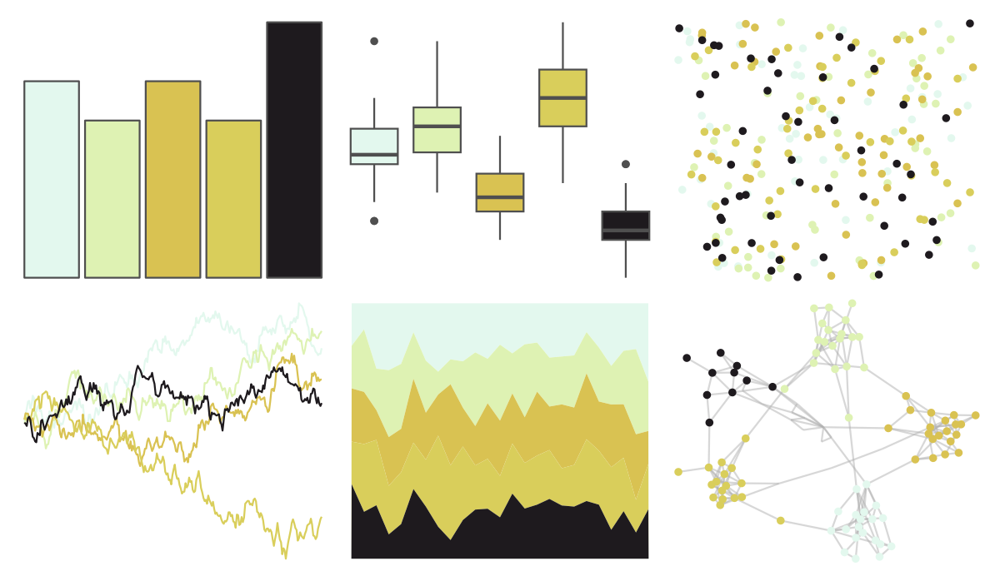

# fishualize - Prognathodes_guyanensis 

::: columns
::: {.column width="50%"}

**Github**

[nschiett/fishualize](https://github.com/nschiett/fishualize)
:::

::: {.column width="50%"}

**CRAN**

[fishualize](https://CRAN.R-project.org/package=fishualize)
:::
:::

<hr> 

Use with [paletteer](https://emilhvitfeldt.github.io/paletteer/) package:

```r
library(paletteer)
paletteer_d("fishualize::Prognathodes_guyanensis")
```

Use raw:

```r
c("#E3F8EEFF", "#DEF2B3FF", "#D9C252FF", "#D9CE5BFF", "#1E1A1EFF")
``` 

 

<br>

# Related Palettes

<div class="list" style="display: grid; grid-template-columns: auto auto auto;"> <figure class="figure">
<a href="../../amerika/Dem_Ind_Rep3/"> </a>
</figure> <figure class="figure">
<a href="../../wesanderson/Moonrise1/"> </a>
</figure> <figure class="figure">
<a href="../../colRoz/nq_stream/"> </a>
</figure> <figure class="figure">
<a href="../../ggthemr/camouflage/"> </a>
</figure> <figure class="figure">
<a href="../../palettetown/gulpin/"> </a>
</figure> <figure class="figure">
<a href="../../colRoz/p_mitchelli/"> </a>
</figure> <figure class="figure">
<a href="../../palettetown/electrike/"> </a>
</figure> <figure class="figure">
<a href="../../tayloRswift/taylorSwift/"> </a>
</figure> <figure class="figure">
<a href="../../nationalparkcolors/Yellowstone/"> </a>
</figure> <figure class="figure">
<a href="../../palettetown/geodude/"> </a>
</figure> <figure class="figure">
<a href="../../lisa/SandySkoglund/"> </a>
</figure> <figure class="figure">
<a href="../../poisonfrogs/Mlaevigata/"> </a>
</figure> 
</div>
