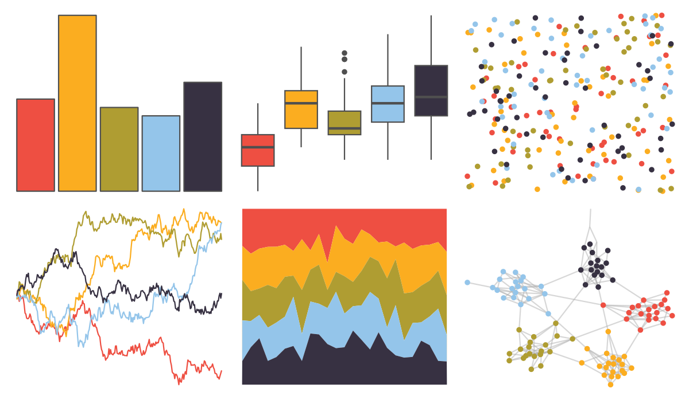

# fishualize - Pseudocheilinus_tetrataenia 

::: columns
::: {.column width="50%"}

**Github**

[nschiett/fishualize](https://github.com/nschiett/fishualize)
:::

::: {.column width="50%"}

**CRAN**

[fishualize](https://CRAN.R-project.org/package=fishualize)
:::
:::

<hr> 

Use with [paletteer](https://emilhvitfeldt.github.io/paletteer/) package:

```r
library(paletteer)
paletteer_d("fishualize::Pseudocheilinus_tetrataenia")
```

Use raw:

```r
c("#EE4F42FF", "#FBAD20FF", "#AF9D32FF", "#94C5EAFF", "#373142FF")
``` 

 

<br>

# Related Palettes

<div class="list" style="display: grid; grid-template-columns: auto auto auto;"> <figure class="figure">
<a href="../../awtools/a_palette/"> </a>
</figure> <figure class="figure">
<a href="../../wesanderson/Rushmore/"> </a>
</figure> <figure class="figure">
<a href="../../wesanderson/Rushmore1/"> </a>
</figure> <figure class="figure">
<a href="../../yarrr/nemo/"> </a>
</figure> <figure class="figure">
<a href="../../tvthemes/CrazyLaceAgate/"> </a>
</figure> <figure class="figure">
<a href="../../fishualize/Koumansetta_rainfordi/"> </a>
</figure> <figure class="figure">
<a href="../../ochRe/olsen_qual/"> </a>
</figure> <figure class="figure">
<a href="../../rtist/raphael/"> </a>
</figure> <figure class="figure">
<a href="../../LaCroixColoR/Apricot/"> </a>
</figure> <figure class="figure">
<a href="../../lisa/MiltonAvery_1/"> </a>
</figure> <figure class="figure">
<a href="../../lisa/JohannesVermeer_1/"> </a>
</figure> <figure class="figure">
<a href="../../lisa/RoyLichtenstein_2/"> </a>
</figure> 
</div>
