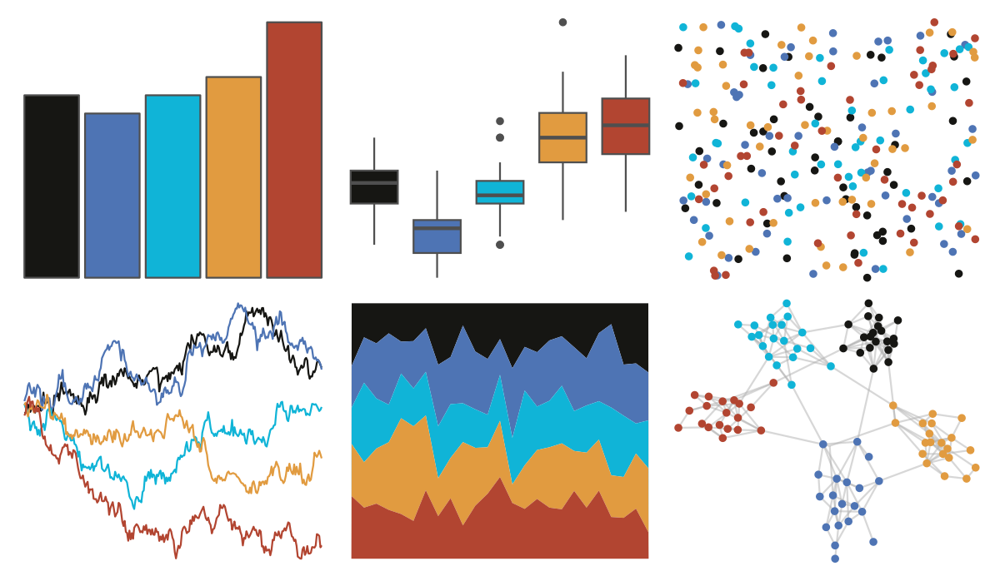

# fishualize - Pseudochromis_aldabraensis 

::: columns
::: {.column width="50%"}

**Github**

[nschiett/fishualize](https://github.com/nschiett/fishualize)
:::

::: {.column width="50%"}

**CRAN**

[fishualize](https://CRAN.R-project.org/package=fishualize)
:::
:::

<hr> 

Use with [paletteer](https://emilhvitfeldt.github.io/paletteer/) package:

```r
library(paletteer)
paletteer_d("fishualize::Pseudochromis_aldabraensis")
```

Use raw:

```r
c("#161613FF", "#4E74B4FF", "#10B4D7FF", "#E19B40FF", "#B24531FF")
``` 

 

<br>

# Related Palettes

<div class="list" style="display: grid; grid-template-columns: auto auto auto;"> <figure class="figure">
<a href="../../amerika/Dem_Ind_Rep3/"> </a>
</figure> <figure class="figure">
<a href="../../ltc/alger/"> </a>
</figure> <figure class="figure">
<a href="../../fishualize/Serranus_scriba/"> </a>
</figure> <figure class="figure">
<a href="../../NatParksPalettes/GrandCanyon/"> </a>
</figure> <figure class="figure">
<a href="../../nbapalettes/knicks_city/"> </a>
</figure> <figure class="figure">
<a href="../../nbapalettes/nets_city/"> </a>
</figure> <figure class="figure">
<a href="../../ltc/expevo/"> </a>
</figure> <figure class="figure">
<a href="../../nbapalettes/knicks_city2/"> </a>
</figure> <figure class="figure">
<a href="../../rockthemes/heep/"> </a>
</figure> <figure class="figure">
<a href="../../PrettyCols/Lively/"> </a>
</figure> <figure class="figure">
<a href="../../ghibli/KikiMedium/"> </a>
</figure> <figure class="figure">
<a href="../../rockthemes/miles/"> </a>
</figure> 
</div>
