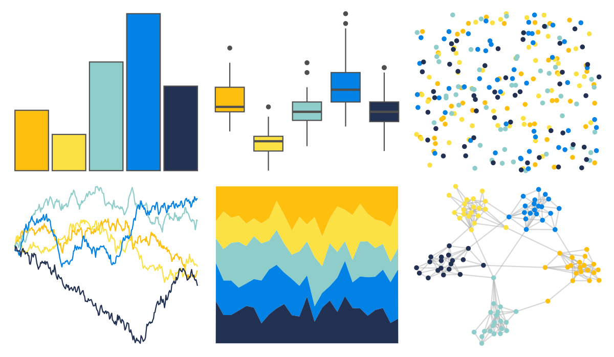
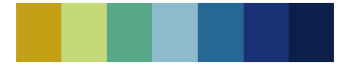
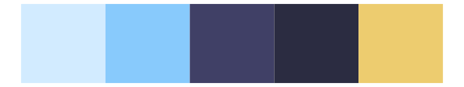
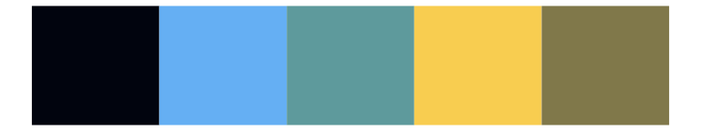
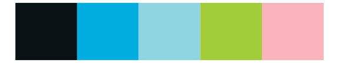
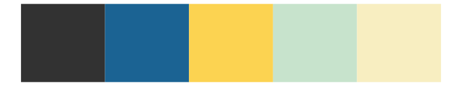
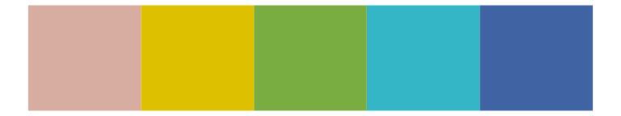
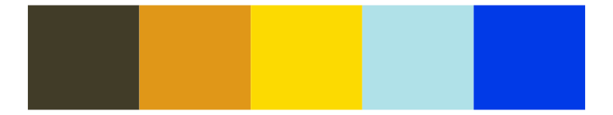

# fishualize - Rhinecanthus_aculeatus 

::: columns
::: {.column width="50%"}

**Github**

[nschiett/fishualize](https://github.com/nschiett/fishualize)
:::

::: {.column width="50%"}

**CRAN**

[fishualize](https://CRAN.R-project.org/package=fishualize)
:::
:::

<hr> 

Use with [paletteer](https://emilhvitfeldt.github.io/paletteer/) package:

```r
library(paletteer)
paletteer_d("fishualize::Rhinecanthus_aculeatus")
```

Use raw:

```r
c("#FFBF0FFF", "#FBE144FF", "#8FCDCAFF", "#0382E5FF", "#223052FF")
``` 

 

<br>

# Related Palettes

<div class="list" style="display: grid; grid-template-columns: auto auto auto;"> <figure class="figure">
<a href="../../amerika/Dem_Ind_Rep3/"> </a>
</figure> <figure class="figure">
<a href="../../LaCroixColoR/Lemon/"> </a>
</figure> <figure class="figure">
<a href="../../rtist/vangogh/"> </a>
</figure> <figure class="figure">
<a href="../../MetBrewer/Hokusai3/"> </a>
</figure> <figure class="figure">
<a href="../../MoMAColors/VanGogh/"> </a>
</figure> <figure class="figure">
<a href="../../blueycolors/bluey/"> </a>
</figure> <figure class="figure">
<a href="../../fishualize/Chaetodontoplus_conspicillatus/"> </a>
</figure> <figure class="figure">
<a href="../../fishualize/Thalassoma_hardwicke/"> </a>
</figure> <figure class="figure">
<a href="../../ggprism/starry2/"> </a>
</figure> <figure class="figure">
<a href="../../vangogh/StarryNight/"> </a>
</figure> <figure class="figure">
<a href="../../MetBrewer/Isfahan2/"> </a>
</figure> <figure class="figure">
<a href="../../fishualize/Stegastes_partitus/"> </a>
</figure> 
</div>
