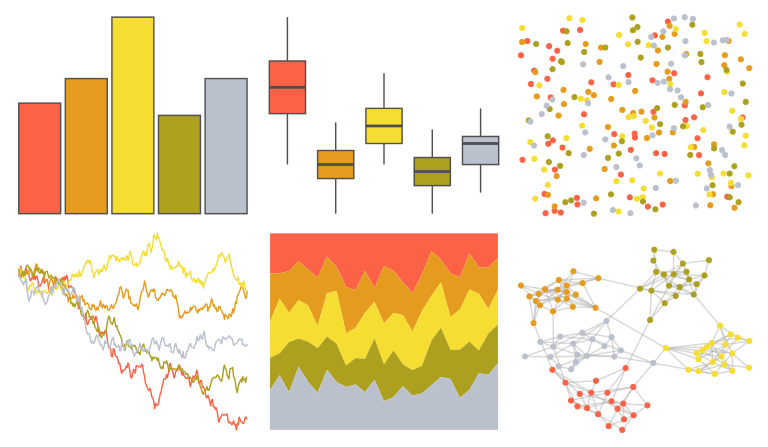

# fishualize - Salmo_salar 

::: columns
::: {.column width="50%"}

**Github**

[nschiett/fishualize](https://github.com/nschiett/fishualize)
:::

::: {.column width="50%"}

**CRAN**

[fishualize](https://CRAN.R-project.org/package=fishualize)
:::
:::

<hr> 

Use with [paletteer](https://emilhvitfeldt.github.io/paletteer/) package:

```r
library(paletteer)
paletteer_d("fishualize::Salmo_salar")
```

Use raw:

```r
c("#FB6246FF", "#E59C1EFF", "#F5DE31FF", "#ADA01FFF", "#BBC0CDFF")
``` 

 

<br>

# Related Palettes

<div class="list" style="display: grid; grid-template-columns: auto auto auto;"> <figure class="figure">
<a href="../../awtools/a_palette/"> </a>
</figure> <figure class="figure">
<a href="../../MetBrewer/Tara/"> </a>
</figure> <figure class="figure">
<a href="../../lisa/RobertDelaunay_1/"> </a>
</figure> <figure class="figure">
<a href="../../tvthemes/AirNomads/"> </a>
</figure> <figure class="figure">
<a href="../../palettetown/ninetales/"> </a>
</figure> <figure class="figure">
<a href="../../nbapalettes/spurs/"> </a>
</figure> <figure class="figure">
<a href="../../wesanderson/Royal2/"> </a>
</figure> <figure class="figure">
<a href="../../rcartocolor/Fall/"> </a>
</figure> <figure class="figure">
<a href="../../fishualize/Hemitaurichthys_polylepis/"> </a>
</figure> <figure class="figure">
<a href="../../ggthemes/excel_Mesh/"> </a>
</figure> <figure class="figure">
<a href="../../lisa/JackYoungerman/"> </a>
</figure> <figure class="figure">
<a href="../../lisa/J_M_W_Turner/"> </a>
</figure> 
</div>
