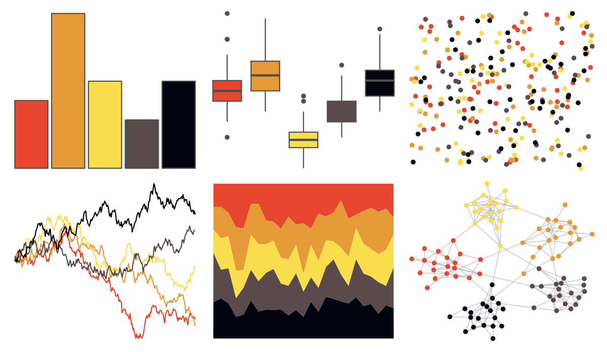

# fishualize - Salvelinus_fontinalis 

::: columns
::: {.column width="50%"}

**Github**

[nschiett/fishualize](https://github.com/nschiett/fishualize)
:::

::: {.column width="50%"}

**CRAN**

[fishualize](https://CRAN.R-project.org/package=fishualize)
:::
:::

<hr> 

Use with [paletteer](https://emilhvitfeldt.github.io/paletteer/) package:

```r
library(paletteer)
paletteer_d("fishualize::Salvelinus_fontinalis")
```

Use raw:

```r
c("#E6452EFF", "#E49A36FF", "#F9DD4CFF", "#5B4A4CFF", "#01040EFF")
``` 

 

<br>

# Related Palettes

<div class="list" style="display: grid; grid-template-columns: auto auto auto;"> <figure class="figure">
<a href="../../amerika/Dem_Ind_Rep3/"> </a>
</figure> <figure class="figure">
<a href="../../calecopal/fire/"> </a>
</figure> <figure class="figure">
<a href="../../DresdenColor/changes/"> </a>
</figure> <figure class="figure">
<a href="../../fishualize/Aulostomus_chinensis/"> </a>
</figure> <figure class="figure">
<a href="../../feathers/spotted_pardalote/"> </a>
</figure> <figure class="figure">
<a href="../../nationalparkcolors/Saguaro/"> </a>
</figure> <figure class="figure">
<a href="../../nationalparkcolors/Hawaii/"> </a>
</figure> <figure class="figure">
<a href="../../fishualize/Pterois_volitans/"> </a>
</figure> <figure class="figure">
<a href="../../MoMAColors/vonHeyl/"> </a>
</figure> <figure class="figure">
<a href="../../poisonfrogs/Eanthonyi/"> </a>
</figure> <figure class="figure">
<a href="../../poisonfrogs/Llineatus/"> </a>
</figure> <figure class="figure">
<a href="../../MoMAColors/Exter/"> </a>
</figure> 
</div>
