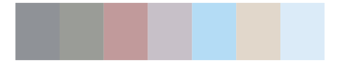
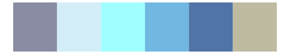

# fishualize - Sardinella_brasiliensis 

::: columns
::: {.column width="50%"}

**Github**

[nschiett/fishualize](https://github.com/nschiett/fishualize)
:::

::: {.column width="50%"}

**CRAN**

[fishualize](https://CRAN.R-project.org/package=fishualize)
:::
:::

<hr> 

Use with [paletteer](https://emilhvitfeldt.github.io/paletteer/) package:

```r
library(paletteer)
paletteer_d("fishualize::Sardinella_brasiliensis")
```

Use raw:

```r
c("#798962FF", "#A9BDB5FF", "#8DA5BEFF", "#A1C7DCFF", "#D3EEFEFF")
``` 

 

<br>

# Related Palettes

<div class="list" style="display: grid; grid-template-columns: auto auto auto;"> <figure class="figure">
<a href="../../awtools/a_palette/"> </a>
</figure> <figure class="figure">
<a href="../../ghibli/LaputaLight/"> </a>
</figure> <figure class="figure">
<a href="../../soilpalettes/gley/"> </a>
</figure> <figure class="figure">
<a href="../../ghibli/SpiritedLight/"> </a>
</figure> <figure class="figure">
<a href="../../ghibli/MarnieLight1/"> </a>
</figure> <figure class="figure">
<a href="../../fishualize/Harengula_jaguana/"> </a>
</figure> <figure class="figure">
<a href="../../beyonce/X54/"> </a>
</figure> <figure class="figure">
<a href="../../DresdenColor/colddays/"> </a>
</figure> <figure class="figure">
<a href="../../Redmonder/sPBIGn/"> </a>
</figure> <figure class="figure">
<a href="../../nationalparkcolors/MtRainier/"> </a>
</figure> <figure class="figure">
<a href="../../rcartocolor/Mint/"> </a>
</figure> <figure class="figure">
<a href="../../ghibli/YesterdayLight/"> </a>
</figure> 
</div>
