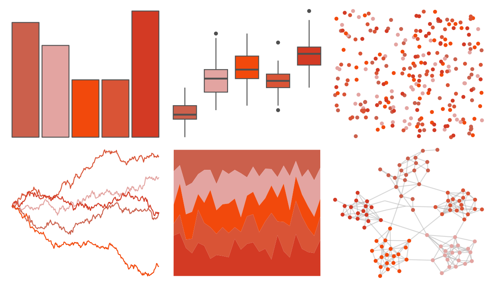
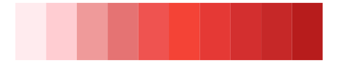

# fishualize - Sargocentron_bullisi 

::: columns
::: {.column width="50%"}

**Github**

[nschiett/fishualize](https://github.com/nschiett/fishualize)
:::

::: {.column width="50%"}

**CRAN**

[fishualize](https://CRAN.R-project.org/package=fishualize)
:::
:::

<hr> 

Use with [paletteer](https://emilhvitfeldt.github.io/paletteer/) package:

```r
library(paletteer)
paletteer_d("fishualize::Sargocentron_bullisi")
```

Use raw:

```r
c("#CB604CFF", "#E3A4A1FF", "#F2490CFF", "#D95436FF", "#D33A24FF")
``` 

 

<br>

# Related Palettes

<div class="list" style="display: grid; grid-template-columns: auto auto auto;"> <figure class="figure">
<a href="../../awtools/a_palette/"> </a>
</figure> <figure class="figure">
<a href="../../fishualize/Sparisoma_tuyupiranga_f/"> </a>
</figure> <figure class="figure">
<a href="../../lisa/TerryFrost/"> </a>
</figure> <figure class="figure">
<a href="../../fishualize/Heretopriacanthus_cruentatus/"> </a>
</figure> <figure class="figure">
<a href="../../ggsci/red_material/"> </a>
</figure> <figure class="figure">
<a href="../../lisa/RupprechtGeiger/"> </a>
</figure> <figure class="figure">
<a href="../../fishualize/Pleuronectes_platessa/"> </a>
</figure> <figure class="figure">
<a href="../../miscpalettes/chocolate/"> </a>
</figure> <figure class="figure">
<a href="../../fishualize/Acanthostracion_polygonius_y/"> </a>
</figure> <figure class="figure">
<a href="../../ggsci/deep_orange_material/"> </a>
</figure> <figure class="figure">
<a href="../../rcartocolor/RedOr/"> </a>
</figure> <figure class="figure">
<a href="../../fishualize/Holocentrus_adscensionis/"> </a>
</figure> 
</div>
