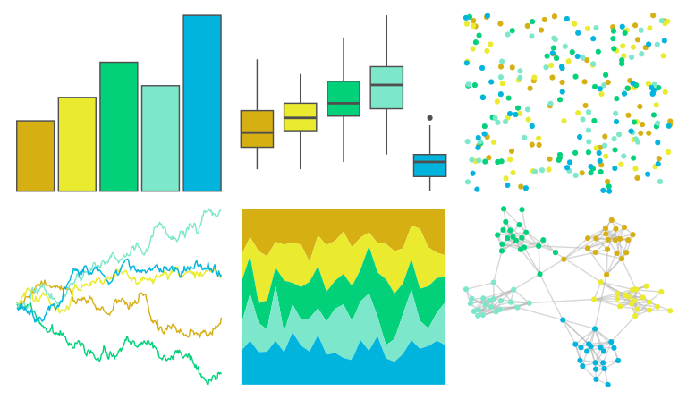

# fishualize - Scarus_ghobban 

::: columns
::: {.column width="50%"}

**Github**

[nschiett/fishualize](https://github.com/nschiett/fishualize)
:::

::: {.column width="50%"}

**CRAN**

[fishualize](https://CRAN.R-project.org/package=fishualize)
:::
:::

<hr> 

Use with [paletteer](https://emilhvitfeldt.github.io/paletteer/) package:

```r
library(paletteer)
paletteer_d("fishualize::Scarus_ghobban")
```

Use raw:

```r
c("#D6AF13FF", "#EAEB2FFF", "#02D17AFF", "#7DE7CBFF", "#01B4DEFF")
``` 

 

<br>

# Related Palettes

<div class="list" style="display: grid; grid-template-columns: auto auto auto;"> <figure class="figure">
<a href="../../awtools/a_palette/"> </a>
</figure> <figure class="figure">
<a href="../../ggthemes/excel_Depth/"> </a>
</figure> <figure class="figure">
<a href="../../ggthemes/excel_Green/"> </a>
</figure> <figure class="figure">
<a href="../../ggthemes/excel_Green_Yellow/"> </a>
</figure> <figure class="figure">
<a href="../../Redmonder/qMSOGnYl/"> </a>
</figure> <figure class="figure">
<a href="../../Redmonder/qMSOGn/"> </a>
</figure> <figure class="figure">
<a href="../../tvthemes/Peridot/"> </a>
</figure> <figure class="figure">
<a href="../../RColorBrewer/YlGn/"> </a>
</figure> <figure class="figure">
<a href="../../nationalparkcolors/Voyageurs/"> </a>
</figure> <figure class="figure">
<a href="../../ggthemes/excel_Blue/"> </a>
</figure> <figure class="figure">
<a href="../../fishualize/Hypoplectrus_puella/"> </a>
</figure> <figure class="figure">
<a href="../../fishualize/Forcipiger_longirostris/"> </a>
</figure> 
</div>
