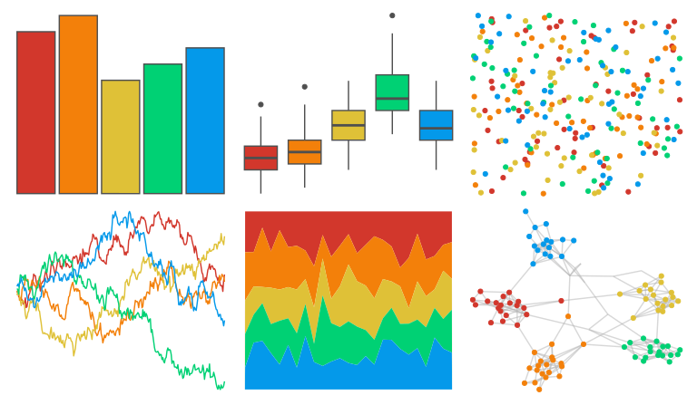

# fishualize - Scarus_hoefleri 

::: columns
::: {.column width="50%"}

**Github**

[nschiett/fishualize](https://github.com/nschiett/fishualize)
:::

::: {.column width="50%"}

**CRAN**

[fishualize](https://CRAN.R-project.org/package=fishualize)
:::
:::

<hr> 

Use with [paletteer](https://emilhvitfeldt.github.io/paletteer/) package:

```r
library(paletteer)
paletteer_d("fishualize::Scarus_hoefleri")
```

Use raw:

```r
c("#D2372CFF", "#F3800AFF", "#DFC137FF", "#00D174FF", "#0499EAFF")
``` 

 

<br>

# Related Palettes

<div class="list" style="display: grid; grid-template-columns: auto auto auto;"> <figure class="figure">
<a href="../../awtools/a_palette/"> </a>
</figure> <figure class="figure">
<a href="../../ggthemes/excel_Vapor_Trail/"> </a>
</figure> <figure class="figure">
<a href="../../wesanderson/Darjeeling1/"> </a>
</figure> <figure class="figure">
<a href="../../RSkittleBrewer/M_M/"> </a>
</figure> <figure class="figure">
<a href="../../fishualize/Lepomis_megalotis/"> </a>
</figure> <figure class="figure">
<a href="../../MetBrewer/Egypt/"> </a>
</figure> <figure class="figure">
<a href="../../yarrr/espresso/"> </a>
</figure> <figure class="figure">
<a href="../../lisa/JackBush/"> </a>
</figure> <figure class="figure">
<a href="../../PNWColors/Bay/"> </a>
</figure> <figure class="figure">
<a href="../../lisa/JackYoungerman/"> </a>
</figure> <figure class="figure">
<a href="../../lisa/RobertDelaunay/"> </a>
</figure> <figure class="figure">
<a href="../../wesanderson/FantasticFox1/"> </a>
</figure> 
</div>
