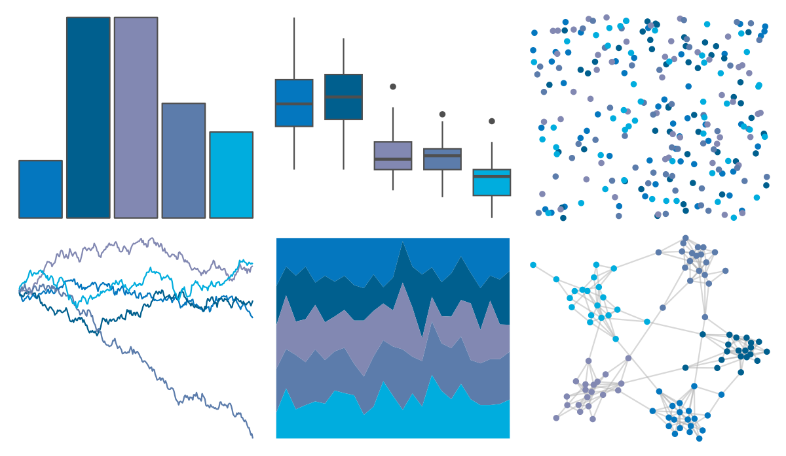
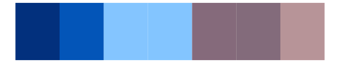

# fishualize - Sparisoma_frondosum_m 

::: columns
::: {.column width="50%"}

**Github**

[nschiett/fishualize](https://github.com/nschiett/fishualize)
:::

::: {.column width="50%"}

**CRAN**

[fishualize](https://CRAN.R-project.org/package=fishualize)
:::
:::

<hr> 

Use with [paletteer](https://emilhvitfeldt.github.io/paletteer/) package:

```r
library(paletteer)
paletteer_d("fishualize::Sparisoma_frondosum_m")
```

Use raw:

```r
c("#0477BFFF", "#005F8EFF", "#8288B2FF", "#5C7CABFF", "#00ADDEFF")
``` 

 

<br>

# Related Palettes

<div class="list" style="display: grid; grid-template-columns: auto auto auto;"> <figure class="figure">
<a href="../../awtools/a_palette/"> </a>
</figure> <figure class="figure">
<a href="../../colRoz/sky/"> </a>
</figure> <figure class="figure">
<a href="../../unikn/pal_petrol/"> </a>
</figure> <figure class="figure">
<a href="../../calecopal/sbchannel/"> </a>
</figure> <figure class="figure">
<a href="../../fishualize/Sparisoma_tuyupiranga_m/"> </a>
</figure> <figure class="figure">
<a href="../../ggthemes/excel_Blue_Warm/"> </a>
</figure> <figure class="figure">
<a href="../../fishualize/Scarus_globiceps/"> </a>
</figure> <figure class="figure">
<a href="../../beyonce/X108/"> </a>
</figure> <figure class="figure">
<a href="../../nbapalettes/hornets2/"> </a>
</figure> <figure class="figure">
<a href="../../beyonce/X15/"> </a>
</figure> <figure class="figure">
<a href="../../ggthemes/excel_Violet_II/"> </a>
</figure> <figure class="figure">
<a href="../../MetBrewer/Hokusai2/"> </a>
</figure> 
</div>
