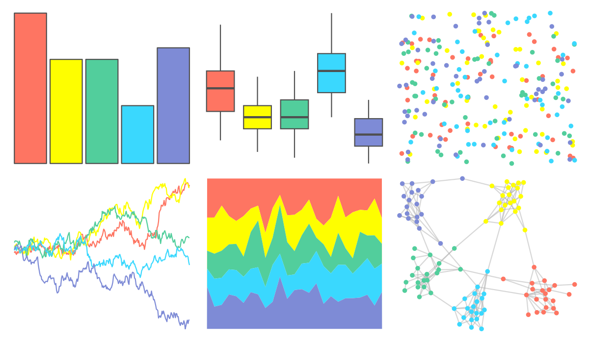

# fishualize - Sparisoma_viride 

::: columns
::: {.column width="50%"}

**Github**

[nschiett/fishualize](https://github.com/nschiett/fishualize)
:::

::: {.column width="50%"}

**CRAN**

[fishualize](https://CRAN.R-project.org/package=fishualize)
:::
:::

<hr> 

Use with [paletteer](https://emilhvitfeldt.github.io/paletteer/) package:

```r
library(paletteer)
paletteer_d("fishualize::Sparisoma_viride")
```

Use raw:

```r
c("#FE7562FF", "#FEFE00FF", "#52CE9CFF", "#3AD8FEFF", "#7E8BD6FF")
``` 

 

<br>

# Related Palettes

<div class="list" style="display: grid; grid-template-columns: auto auto auto;"> <figure class="figure">
<a href="../../awtools/a_palette/"> </a>
</figure> <figure class="figure">
<a href="../../ButterflyColors/hamadryas_feronia/"> </a>
</figure> <figure class="figure">
<a href="../../ButterflyColors/hamadryas_feronia/"> </a>
</figure> <figure class="figure">
<a href="../../fishualize/Cirrhilabrus_solorensis/"> </a>
</figure> <figure class="figure">
<a href="../../MetBrewer/Isfahan2/"> </a>
</figure> <figure class="figure">
<a href="../../ltc/fernande/"> </a>
</figure> <figure class="figure">
<a href="../../ggthemes/excel_Slipstream/"> </a>
</figure> <figure class="figure">
<a href="../../nationalparkcolors/Zion/"> </a>
</figure> <figure class="figure">
<a href="../../fishualize/Ctenochaetus_strigosus/"> </a>
</figure> <figure class="figure">
<a href="../../waRhol/the_big_c_86/"> </a>
</figure> <figure class="figure">
<a href="../../ggthemes/excel_Vapor_Trail/"> </a>
</figure> <figure class="figure">
<a href="../../rcartocolor/Temps/"> </a>
</figure> 
</div>
