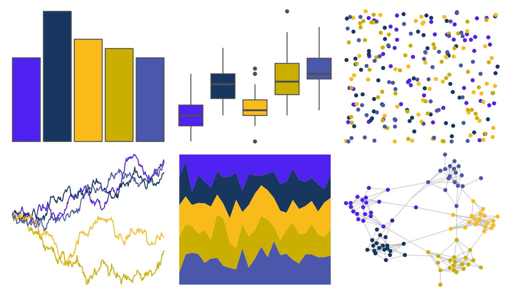

# fishualize - Stegastes_variabilis 

::: columns
::: {.column width="50%"}

**Github**

[nschiett/fishualize](https://github.com/nschiett/fishualize)
:::

::: {.column width="50%"}

**CRAN**

[fishualize](https://CRAN.R-project.org/package=fishualize)
:::
:::

<hr> 

Use with [paletteer](https://emilhvitfeldt.github.io/paletteer/) package:

```r
library(paletteer)
paletteer_d("fishualize::Stegastes_variabilis")
```

Use raw:

```r
c("#4F22F2FF", "#173761FF", "#F8BB19FF", "#CAAF01FF", "#4A57AAFF")
``` 

 

<br>

# Related Palettes

<div class="list" style="display: grid; grid-template-columns: auto auto auto;"> <figure class="figure">
<a href="../../awtools/a_palette/"> </a>
</figure> <figure class="figure">
<a href="../../fishualize/Halichoeres_dimidiatus/"> </a>
</figure> <figure class="figure">
<a href="../../lisa/VincentvanGogh/"> </a>
</figure> <figure class="figure">
<a href="../../fishualize/Chromis_vanderbilti/"> </a>
</figure> <figure class="figure">
<a href="../../nbapalettes/nuggets/"> </a>
</figure> <figure class="figure">
<a href="../../lisa/YvesKlein/"> </a>
</figure> <figure class="figure">
<a href="../../nbapalettes/pacers_foundation/"> </a>
</figure> <figure class="figure">
<a href="../../nbapalettes/mavericks_banner/"> </a>
</figure> <figure class="figure">
<a href="../../fishualize/Zebrasoma_xanthurum/"> </a>
</figure> <figure class="figure">
<a href="../../fishualize/Bodianus_rufus/"> </a>
</figure> <figure class="figure">
<a href="../../colRoz/desert_dusk/"> </a>
</figure> <figure class="figure">
<a href="../../fishualize/Pomacanthus_imperator/"> </a>
</figure> 
</div>
